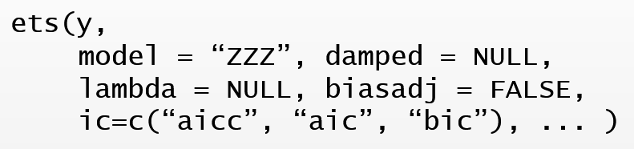
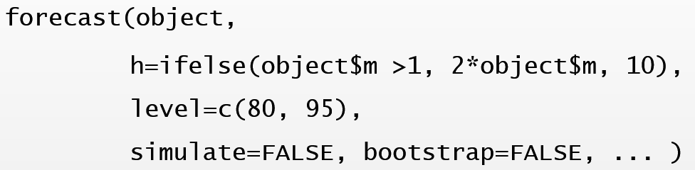

# ETS 모형{#chapter-ets}

지수평활법 (Exponential smoothing)은 1950년대에 개발된 예측 기법이다. 단순하지만 나름 상당히 효과적인 예측이 가능한 기법으로 알려져 있다. 기본적인 예측 방식은 과거 자료의 가중평균을 이용하는 것인데, 예측 시점에서 멀어질수록 가중값이 지수적으로 감소하는 형식을 취하고 있다.

전통적인 지수평활법은 시계열자료에 추세 또는 계절 성분이 포함되어 있는지 여부를 사용자가 결정하고, 그 결과에 따라 가장 적합한 방법을 선택해야 한다. 추세와 계절 성분이 모두 없다고 판단되면 simple exponential smoothing을, 추세 성분이 있다고 본다면 Holt's linear trend method를, 추세 및 계절 성분이 모두 있다고 본다면 Holt-Winter's seasonal method를 선택해야 한다. 그런데 시계열자료 중에는 각 성분의 포함 여부가 명확하게 구분되지 않는 경우가 많이 있을 수 있으며, 따라서 사용자가 주관적인 기준으로 모형을 선택해야 하는 상황이 종종 발생하게 된다.

전통적인 지수평활법에 오차모형을 도입하여 통계적 모형으로 확장한 모형이 최근들어 제시되었다. ETS 모형이라고 불리는 이 모형은 전통적 지수평활법의 한계를 확실하게 극복한 새로운 통계적 모형으로써, 최근에 가장 많이 사용되고 있는 예측 모형 중 하나이다.

ETS 모형을 시작으로 우리는 앞으로 다양한 시계열 예측 모형을 살펴볼 것이다. 각 예측 모형의 원리와 작동 방식 및 실제 적용 방법 등을 자세히 알아볼 것인데, 더 먼저 살펴봐야 하는 것은 예측모형의 평가 방법이다. 실제 상황에서 우리는 주어진 시계열자료에 대하여 다양한 예측모형을 사용하여 예측을 실시하게 된다. 문제는 예측모형이 다르면 예측 결과도 당연히 다르게 되는데, 그 중 어떤 것이 최선의 예측인지 선택해야 한다는 것이다.

## 예측 모형의 평가 {#section-accuracy}

미래 시점에 대한 예측 결과의 평가는 시간이 흘러 해당 시점에 대한 관측이 이루어져야 정확하게 이루어질 수 있지만, 이것에 준하는 현실적인 방안이 필요하다고 하겠다. 예측 모형의 평가에 사용되는 가장 일반적인 방법은 전체 자료를 training data와 test data로 분리해서, training data만으로 예측 모형을 적합하고 test data에 대한 예측을 실시하고 평가하는 것이다.

시계열자료는 자료의 순서가 그대로 유지되어야 하는 구조이기 때문에, $y_{1}, \ldots, y_{T}$를 training data로 사용하고, $y_{T+1}, y_{T+2}, \ldots$를 test data로 설정하게 된다. Test data의 크기는 대략 전체 자료의 20% 정도로 선택하는 것이 일반적이지만, 자료의 전체 크기나 예측 시차 `h` 등을 고려해서 사용자가 결정해야 한다.

Training data $(y_{1}, \ldots, y_{T})$는 모수 추정 등을 통한 예측 모형의 적합에 사용되는 자료이며, 적합값 $(\hat{y}_{t})$와 관측값 $(y_{t})$의 차이가 잔차 $(e_{t} = y_{t} - \hat{y}_{t})$, $t=1,\ldots, T~$가 된다. Training data에 적합이 잘되는 예측 모형이라면 전체적으로 잔차의 값이 작을 텐데, 그렇다고 해서 test data에 대한 예측도 반드시 잘된다는 것을 의미하지는 않는다. 오히려 training data에 대해 너무 완벽하게 적합이 잘되는 모형은 over-fitting된 모형일 가능성이 높고, 그렇다면 전혀 새로운 test data에 대해서는 예측이 매우 좋지 않을 수 있다.

Test data $(y_{T+1}, y_{T+2}, \ldots)$는 예측 모형의 예측력을 평가하기 위해 남겨 놓은 자료이다. 예측의 정확도는 예측 오차 $(e_{T+h} = y_{T+h} - \hat{y}_{T+h}, ~~h=1, 2, 3, \ldots)$를 대상으로 평가 측도를 계산함으로써 평가할 수 있는데, 우선 생각할 수 있는 측도에는 예측 오차의 평균적인 크기를 계산하는 것이다.

-   MAE (Mean Absolute Error) : $mean(~|e_{t}|~)$

-   RMSE (Root Mean Squared Error) : $\sqrt{mean(e_{t}^{2})}$

MAE와 RMSE는 보편적으로 많이 사용되는 평가 측도이다. 다만, 자료의 스케일에 영향을 받는 측도이어서, 단위가 서로 다른 자료를 대상으로 하는 예측 비교에는 사용할 수 없다.

자료의 스케일에 영향을 받지 않는 측도로써 퍼센트 오차를 생각할 수 있다.

-   MAPE (Mean Absolute Percentage Error) : $mean(|100 \times \frac{e_{t}}{y_{y}}|)$

MAPE는 자료의 단위에 관계 없이 비교가 가능하다는 장점이 있으나, 개별 자료값이 측도의 분모로 들어가기 때문에 0 또는 0에 가까운 값이 있는 자료에는 사용하기 어려운 문제가 있다.

오차 크기를 상대화 시키는 기준으로 training data에 대한 naive forecast $(\hat{y}_{t+1} = y_{t})$의 MAE를 사용하는 것이 좋은 방법이 될 수 있다.

-   MASE (Mean Absolute Scaled Error) : $mean(|\frac{e_{t}}{E}|)$, $~~~E=\frac{1}{T-1}\sum_{t=2}^{T}|y_{t}-y_{t-1}|$

MASE는 자료의 스케일에 영향을 받지 않는 측도이고, MAPE가 갖고 있는 문제도 없는 측도이다. MASE가 1보다 값이 크다면, training data를 대상으로 계산된 naive forecast보다 예측력이 떨어진다는 의미가 된다.

예측 오차의 다양한 평가 측도의 계산은 함수 `forecast::accuracy()`로 할 수 있다. 자세한 사용법은 예제와 함께 살펴보겠다.

## 전통적 지수평활법 {#section-exponential}

전통적 지수평활법에는 simple exponential smmothing과 Holt's trend method, 그리고 Holt-Winter's seasonal method가 있다. 각 방법의 기본 개념과 살행 방법 등을 살펴보도록 하자.

### Simple exponential smoothing

명확한 추세나 계절 성분은 없으며, 국지적으로는 자료의 평균수준 (level)이 일정하지만 전체적으로는 평균수준에 변화가 있는 시계열자료의 예측에 적합한 평활 기법이다.

Simple exponential smoothing에서는 주어진 시계열자료 $y_{1}, \ldots, y_{t}$를 이용한 $(t+1)$ 시점에 대한 1-시차 후 예측값 $\hat{y}_{t+1|t}$을 다음과 같이 계산한다.

```{=tex}
\begin{equation}
\hat{y}_{t+1|t} = \alpha y_{t} + \alpha(1-\alpha) y_{t-1} + \alpha(1-\alpha)^{2} y_{t-2} + \cdots
(\#eq:ses-1)
\end{equation}
```
단, $0 \leq \alpha \leq 1$는 평활상수이다.

식 \@ref(eq:ses-1)에 표현된 simple exponential smoothing에 의한 1-시차 후 예측값은 기본적으로 과거 자료의 가중 평균이다. 또한 가중값은 시점 $t$에서 멀어질수록, 즉 더 먼 과거 자료일수록 지수적으로 감소한다는 것도 알 수 있다. 평활상수 $\alpha$의 역할은 가중값의 감소 정도를 조절하는 것으로써, 값이 작아질수록 과거 자료에 더 큰 비중을 두게 되지만, 1에 가까운 큰 값을 갖게 되면 예측값 계산에 최근 관찰값의 정보를 주로 사용하게 된다.

식 \@ref(eq:ses-1)은 다른 형태로 다시 표현할 수 있는데, 우선 다음과 같이 $y_{t}$와 $\hat{y}_{t|t-1}$의 가중 평균으로 표현될 수 있다.

```{=tex}
\begin{equation}
\hat{y}_{t+1|t} = \alpha y_{t} + (1-\alpha) \hat{y}_{t|t-1} (\#eq:ses-2)
\end{equation}
```
Simple exponential smoothing은 추세와 계절 성분은 없고, 단지 국지적으로 일정한 평균수준 (level)만이 있는 모형이다. 따라서 식 \@ref(eq:ses-2)는 다음과 같이 모형 추정식과 예측식으로 구분해서 표현할 수 있다.

-   `h` 시차 후 예측값 추정식

```{=tex}
\begin{equation}
\hat{y}_{t+h|t} = l_{t}
\end{equation}
```
-   평균수준 추정식

```{=tex}
\begin{equation}
l_{t} = \alpha y_{y} + (1-\alpha) l_{t-1}
\end{equation}
```
단, $l_{t}$는 $t$ 시점에서의 평균수준이고, $\alpha$는 평균수준에 대한 평활상수이다.

Simple exponential smoothing을 실시하기 위한 함수는 `forecast::ses()`이며, 대략적인 사용법은 `ses(y, h = 10, level = c(80, 95))`이다. `y`에는 숫자형 벡터이거나 `ts` 개체를 지정하고, `h`는 예측 시차를 지정하는 것으로써 10 시차까지의 예측이 디폴트이다. `level`은 예측구간에 대한 신뢰계수를 지정하는 것인데, 전통적 지수평활법으로는 예측구간을 계산할 수 없기 때문에, \@ref(section-ets)절에서 소개되는 ETS 모형 중 simple exponential smoothing에 대응되는 모형으로 계산한다.

-   예제: `fpp2::oil`

`fpp2::oil`은 1965년부터 2013년까지 Saudi Arabia의 연간 원유 생산량 자료이다. 1996년 이후 자료에 대해 simple exponential smoothing을 적용해 보자.

```{r, message=FALSE}
library(fpp2)
oil_1996 <- window(oil, start = 1996)
```

1996년 이후 연간 원유 생산량 자료의 시계열 그래프를 작성해 보자.

```{r oil-1996, fig.cap="1996년 이후 Saudi Arabia 연간 원유 생산량"}
autoplot(oil_1996) + 
  labs(title = "Annual oil production in Saudi Arabia since 1996", y = NULL)
```

함수 `ses()`를 사용하여 2014 \~ 2016의 원유 생산량을 예측해 보자.

```{r}
ses(oil_1996, h = 3) %>% 
  summary()
```

Level에 대한 평활상수가 $\alpha = 0.8339$으로 추정되었다는 것은 level에 큰 변화가 있는 자료를 의미한다. 이제 예측 결과를 그래프로 나타내 보자.

```{r oil-1996-fore, fig.cap="1996년 이후 Saudi Arabia 연간 원유 생산량 및 2014년 이후 예측 결과"}
ses(oil_1996, h = 3) %>% 
  autoplot() + 
  labs(y = NULL)
```

파란 실선으로 표시된 예측값은 마지막 level 추정값으로써, 모든 `h`에 대하여 동일하다는 것을 알 수 있다. 예측값을 표시한 실선을 포함하고 있는 짙은 파란 색 영역은 80% 예측 구간을 표시한 것이고, 옅은 파란 색 영역은 95% 예측 구간을 표시한 것이다. 예측 시차가 증가함에 따라 예측 구간의 폭은 계속 넓어지고 있음을 알 수 있다.

### Trend method

추세 성분이 있는 시계열자료의 예측에 적합한 평활기법이며, 두 가지 방식이 주로 사용된다. 먼저 Holt's linear trend method는 일정한 추세가 계속 유지된다는 가정에서 예측을 실시하는 기법이다. 단기 예측에서는 큰 문제가 없겠지만, 장기 예측에서는 over-forecast의 가능성이 있다. 두 번째는 Damped Holt's trend method인데, 여기에서는 추세를 항상 일정하게 두지 않고, 추세의 기울기가 점차 감소한다는 가정에서 예측을 실시한다. 많은 경우에 성공적인 예측 결과를 보이고 있는 기법으로 알려져 있다.

1.  Holt's linear trend method

모형을 구성하고 있는 성분은 level 부분과 trend 부분으로 구분된다. 두 구성 요소의 추정식과 `h` 시차 이후의 예측값 추정식은 다음과 같이 주어진다.

-   $t$ 시점에서의 level 추정식

```{=tex}
\begin{equation}
l_{t} = \alpha y_{t} + (1-\alpha) (l_{t-1} + b_{t-1}) 
\end{equation}
```
-   $t$ 시점에서의 trend 추정식

```{=tex}
\begin{equation}
b_{t} = \beta (l_{t} - l_{t-1}) + (1-\beta) b_{t-1}
\end{equation}
```
-   예측값 추정식

```{=tex}
\begin{equation}
\hat{y}_{t+h|t} = l_{t} + h b_{t} (\#eq:holt)
\end{equation}
```
단, $0 \leq \alpha \leq 1$는 level에 대한 평활상수이고, $0 \leq \beta \leq 1$은 trend에 대한 평활상수이다.

식 \@ref(eq:holt)에서 `h` 시차 이후 예측값은 level의 마지막 추정 값과 trend 마지막 추정 값에 예측 시차 h를 곱한 결과의 덧셈으로 계산된다는 것을 볼 수 있다. 즉, 예측값은 예측 시차 h가 증가함에 따라 계속 증가하거나 ($b_{t} > 0$) 혹은 감소하게 되어서 ($b_{t} < 0$), 장기 예측의 경우에는 over-forecast의 가능성이 있는 것이다.

2.  Damped Holt's trend method

Holt's linear trend method의 over-forecast 문제를 해결하기 위해 제안된 방법이다. 모형을 구성하고 있는 level 부분과 trend 부분 요소의 추정식 및 `h` 시차 이후의 예측값 추정식은 다음과 같이 주어진다.

-   $t$ 시점에서의 level 추정식

```{=tex}
\begin{equation}
l_{t} = \alpha y_{t} + (1-\alpha) (l_{t-1} + \phi b_{t-1}) 
\end{equation}
```
-   $t$ 시점에서의 trend 추정식

```{=tex}
\begin{equation}
b_{t} = \beta (l_{t} - l_{t-1}) + (1-\beta) \phi b_{t-1}
\end{equation}
```
-   예측값 추정식

```{=tex}
\begin{equation}
\hat{y}_{t+h|t} = l_{t} + (\phi + \phi^{2} + \cdots + \phi^{h}) b_{t} (\#eq:damp-holt)
\end{equation}
```
단, $0 \leq \alpha \leq 1$는 level에 대한 평활 상수이고, $0 \leq \beta \leq 1$은 trend에 대한 평활 상수이다. 또한 $0 \leq \phi \leq 1$은 damping 모수로써, 예측에서 추세의 영향력 약화 정도를 조절하는 역할을 한다. $\phi = 1$이면 Holt's linear trend method와 동일한 모형이 된다.

식 \@ref(eq:damp-holt)에서 볼 수 있는 것은 예측 시차 `h`가 큰 값을 갖게 되는 장기 예측에서는 예측값이 계속 증가하거나 감소하는 것이 아니라, 일정한 값으로 수렴한다는 것이다. 이것이 의미하는 것은 단기 예측에서는 추세 성분이 명확하게 영향을 주게 되지만 장기 예측에서는 추세 성분의 영향력이 점점 약해지고, 따라서 over-forecast의 문제가 발생하지 않게 된다는 점이다.

Trend method를 적용하기 위한 함수는 `forecast::holt()`이며, 사용법은 `holt(y, h = 10, damped = FALSE, level = c(80, 95))`이다. Holt's linear trend method를 사용한다면, `damped = FALSE`를 지정하면 되고, damped Holt's trend method를 사용하려면, `damped = TRUE`를 지정하면 된다.

-   예제: `fpp2::ausair`

`fpp2::ausair`는 1970년부터 2016년까지 호주의 연간 항공기 승객 수 자료이다. Holt's linear trend와 damped Holt's trend 모형을 이용해서 예측을 실시해 보자.

먼저 시계열 그래프를 작성해 보자.

```{r aus-air, echo=FALSE, fig.cap="1970년부터 2016년까지 호주의 연간 항공기 승객 수"}
autoplot(ausair) +
  labs(title = "Air Transport Passengers Australia: 1970 ~ 2016", y = NULL)
```

Holt's linear trend 모형을 함수 `holt()`를 사용해서 적합시키고, 15 시차에 대한 예측 결과를 그래프에 나타내 보자.

```{r aus-air-fore1, fig.cap="`ausair` 자료에 대한 Holt's linear trend method의 예측 결과"}
holt(ausair, h = 15) %>% 
  autoplot()
```

Damped Holt's trend 모형에 의한 예측 결과도 그래프로 나타내 보자.

```{r aus-air-fore2, fig.cap="`ausair` 자료에 대한 damped Holt's trend method의 예측 결과"}
holt(ausair, h = 15, damped = TRUE) %>% 
  autoplot()
```

Figure \@ref(fig:aus-air-fore1)에서 볼 수 있듯이 Holt's linear trend method에 의한 예측 결과는 지속적으로 증가하고 있으며, 반면에 damped Holt's trend method에 의한 예측 결과는 상승 기울기가 점점 줄어들고 있다는 것을 Figure \@ref(fig:aus-air-fore2)에서 볼 수 있다.

### Holt-Winters' seasonal method

Holt-Winters' seasonal method는 계절성분을 설명하기 위해서 Holt's trend method를 확장한 것이다. 따라서 모형은 level과 trend 그리고 season 성분으로 구성되어 있고, 이것으로 예측값을 추정하게 된다.

Holt-Winters' method는 계절 요소의 형태에 따라서 가법 모형과 승법 모형으로 구분되는데, 가법 모형은 계절 변동 폭이 대략 일정한 모습을 보이는 자료에 적합한 모형이고, 승법 모형은 계절 변동 폭이 자료의 평균 수준 (level)에 비례해서 변하는 경우에 적합한 모형이다. 따라서 증가하는 추세를 갖고 있는 자료의 경우에, 시간이 흐름에 따라 변동 폭이 함께 증가는 모습을 보인다면, 승법 모형이 더 적합한 모형이 될 것이다.

Holt-Winters' additive seasonal method의 성분은 다음과 같이 표현된다.

-   $t$ 시점에서의 level 추정식

```{=tex}
\begin{equation}
l_{t} = \alpha (y_{t} - s_{t-m}) + (1-\alpha)(l_{t-1}+b_{t-1})
\end{equation}
```
-   $t$ 시점에서의 trend 추정식

```{=tex}
\begin{equation}
b_{t} = \beta (l_{t} - l_{t-1}) + (1-\beta)b_{t-1}
\end{equation}
```
-   $t$ 시점에서의 season 추정식

```{=tex}
\begin{equation}
s_{t} = \gamma (y_{t} - l_{t-1} - b_{t-1}) + (1-\gamma) s_{t-m}
\end{equation}
```
-   예측값 추정식

```{=tex}
\begin{equation}
\hat{y}_{t+h} = l_{t} + hb_{t} + s_{t+h-m(k+1)}
\end{equation}
```
단, $\alpha, \beta, \gamma$는 평활 상수이고, $m$은 계절 성분의 주기로써 예컨대 월별 자료이면 $m=12$, 분기별 자료이면 $m=4$가 된다. 또한 예측값 추정식에 있는 $k$는 $(h-1)/m$의 정수 부분이다.

Holt-Winters' multiplicative seasonal method의 성분은 다음과 같이 표현된다.

-   $t$ 시점에서의 level 추정식

```{=tex}
\begin{equation}
l_{t} = \alpha \frac{y_{t}}{s_{t-m}} + (1-\alpha)(l_{t-1}+b_{t-1})
\end{equation}
```
-   $t$ 시점에서의 trend 추정식

```{=tex}
\begin{equation}
b_{t} = \beta (l_{t} - l_{t-1}) + (1-\beta)b_{t-1}
\end{equation}
```
-   $t$ 시점에서의 season 추정식

```{=tex}
\begin{equation}
s_{t} = \gamma \frac{y_{t}}{(l_{t-1} + b_{t-1}} + (1-\gamma) s_{t-m}
\end{equation}
```
-   예측값 추정식

```{=tex}
\begin{equation}
\hat{y}_{t+h} = (l_{t} + hb_{t}) s_{t+h-m(k+1)}
\end{equation}
```
또한 Holt-Winters' seasonal method에서도 추세 성분에 대한 damping이 가법 모형과 승법 모형 모두에서 가능하다. 따라서 Holt-Winters' seasonal method는 계절 성분의 형태와 damping 유무에 따라 additive seasonal method, damped additive seasonal method, multiplicative seasonal method, 그리고 damped multiplicative seasonal method의 4가지 모형으로 구분된다.

모형 적합 및 예측은 함수 `forecast::hw()`로 할 수 있으며, 사용법은 다음과 같다.

`hw(y, damped = FALSE, h = 2*frequency(y), level = c(80, 95), seasonal = c("additive", "multiplicative"))`

-   예제: `fpp2::austourists`

`fpp2::austourists`는 199년부터 2015년까지 분기별 호주에 입국한 외국인 관광객 수 자료이다. Holt-Winters' seasonal 모형을 이용해서 예측을 실시해 보자. 먼저 시계열 그래프를 작성해 보자.

```{r austour-1, fig.cap="199년부터 2015년까지 분기별 호주에 입국한 외국인 관광객 수", echo=FALSE}
autoplot(austourists) +
  labs(y = NULL, title = "International Tourists to Australia")
```

먼저 가법 모형으로 예측을 실시하고 결과를 그래프에 나타내 보자.

```{r austour-2, fig.cap="`austourists` 자료에 대한 Holt-Winters' additive seasonal method의 예측 결과"}
hw(austourists) %>% 
  autoplot() + labs(y = NULL)
```

이번에는 승법 모형으로 예측을 실시하고 결과를 그래프로 나타내 보자.

```{r austour-3, fig.cap="`austourists` 자료에 대한 Holt-Winters' multiplicative seasonal method의 예측 결과"}
hw(austourists, seasonal = "multiplicative") %>% 
  autoplot() + labs(y = NULL)
```

## ETS 모형 {#section-ets}

### 전통적 지수평활법의 확장

\@ref(section-exponential)절에서 우리는 전통적 지수평활법에 의한 예측 방식을 살펴보았다. 전통적 지수평활법을 사용하면 `h` 시차 후 예측값은 산출할 수 있으나, 예측 구간은 추정할 방법이 없었다. 이것은 전통적 지수평활법이 예측값을 산출하는 단순 수식에 불과하기 때문인데, 따라서 오차모형을 포함한 통계적 모형으로 확장할 필요가 있는 것이다.

최근에 개발된 ETS 모형은 전통적인 지수평활법에 기반으로 두고 있는 통계적 모형이다. 따라서 ETS 모형을 사용하면 전통적인 지수평활법과 동일한 예측값을 산출하며, 예측 구간도 추정할 수 있는 것이다.

-   지수평활법 구성 요소의 분해

지수평활법에 속한 여러 모형에서 추세 성분은 None (N)과 Additive (A), 그리고 Damped additive (A~d~)의 형태를 취하고 있다. 또한 계절 성분도 None (N)과 Additive (A), 그리고 Multiplicative (M)의 형태를 취하고 있다. 각각 3가지 형태의 추세 및 계절 성분의 조합을 구성하면, 모두 9가지 모형을 구성할 수 있다. 즉, (Trend, Seasonal)의 가능한 조합은 (N, N), (N, A), (N, M), (A, N), (A, A), (A, M), (A~d~, N), (A~d~, A), (A~d~, M)와 같다.

\@ref(section-exponential)절에서 살펴본 모형을 (Trend, Seasonal) 조합의 형태로 표현하면 다음과 같다.

| (Trend, Seasonal) 조합 | 전통적 지수평활법 모형                      |
|:----------------------:|:--------------------------------------------|
|        (N , N)         | Simple exponential smoothing                |
|        (A , N)         | Holt's linear trend model                   |
|       (A~d~ , N)       | Damped Holt's trend model                   |
|         (A, A)         | Additive Holt-Winters' seasonal model       |
|       (A~d~ , A)       | Additive Holt-Winters' damped model         |
|         (A, M)         | Multiplicative Holt-Winters' seasonal model |
|       (A~d~ , M)       | Multiplicative Holt-Winters' damped model   |

-   오차 모형의 도입

지수평활법을 통계적 모형으로 확장하기 위해서는 1시차 후 예측 오차가 확률분포를 갖는다는 가정이 필요하다. 확률 오차 모형이 도입되면 각 모형의 모수를 최우추정법으로 추정할 수 있으며, 예측 구간도 추정할 수 있다. 또한 최적 모형 선택을 위한 기준을 마련할 수 있게 된다.

예측 오차에 대한 일반적인 가정은 $\epsilon_{t}$는 서로 독립이며, 평균이 0이고 분산이 $\sigma^{2}$인 정규분포라는 것이다.\
또한 예측 오차는 가법 오차와 승법 오차로 구분할 수 있는데, 가법 오차는 $\epsilon_{t} = y_{t} - \hat{y}_{t|t-1}$으로 표현되고, 승법 오차는 $\epsilon_{t} = (y_{t} - \hat{y}_{t|t-1})/\hat{y}_{t|t-1}$으로 표현된다.

-   ETS 모형 설정

ETS 모형은 추세와 계절 및 오차 성분의 각 형태를 모두 조합하여 구성한다. 앞에서 (Trend, Seasonal)의 조합에 의해 9개 모형이 설정되는 것을 보았다. 여기에 두 가지 오차 성분인 Additive (A)와 Multiplicative (M)를 추가하면, 모두 18개 모형을 구성할 수 있게 되는데, 이렇게 구성되는 모형은 `ETS(Error, Trend, Seasonal)`의 형태로 각 성분을 표시한다. 예를 들어, `ETS(A, N, N)` 모형은 simple exponential smoothing with additive error model이 되고, `ETS(A, A, A)`는 additive Holt-Winters' seasonal method with additive error model이 된다.

### 모형 적합 및 최적 모형 선택

-   모수 추정

ETS 모형의 모수에는 평활상수인 $\alpha$, $\beta$, $\gamma$, $\phi$와 level, trend 및 seasonal 요소의 초기값들이 있다. 예측 오차의 분포를 가정했기 때문에, ETS 모형의 모수들은 최우추정법 (Maximum likelihood estimation)으로 추정할 수 있다. 추정 과정에 대한 자세한 설명은 @hyndman2018 을 참조하면 된다.

-   모형 선택

통계적 모형이 갖고 있는 큰 장점 중 하나는 모형 선택 기준으로 AIC와 같은 information criteria를 사용할 수 있다는 점이다. 따라서 ETS 모형 중 주어진 시계열자료에 가장 적합한 모형을 선택할 때, 사용자의 주관적인 기준이 아닌 객관적인 기준을 사용할 수 있게 되었다.

모형 선택 기준으로 많이 사용하는 통계량에는 AIC, AIC~c~ , 그리고 BIC가 있다. 각 통계량의 정의는 다음과 같다.

$$AIC = -2\log(L) + 2k$$

$$AIC_{c} = AIC + \frac{2k(k+1)}{T-k-1}$$

$$
BIC = -2\log(L) + k\log(T)
$$

단, $L$ 은 모형의 우도 함수 (Likelihood of model)이고, $k$ 는 모형의 모수 개수, 그리고 $T$ 는 시계열자료의 크기, 즉 자료의 개수이다. 자료의 수가 충분히 크지 않는 경우에는 $AIC_{c}$ 의 사용이 추천된다. 따라서 ETS 모형 중 $AIC_{c}$ 의 값이 가장 작은 모형을 예측모형으로 선택하면 된다.

-   최적 ETS 모형 선택을 위한 함수: `forecast::ets()`

ETS 모형 적합 및 최적 모형 선택은 함수 `forecast::ets()`로 진행할 수 있으며, 사용법은 다음과 같다.

{width="300"}

`y`는 숫자형 벡터 또는 `ts` 객체이고,

`model`에는 세 가지 ETS 모형 요소 (Error, Trend, Seasonal)의 형태를 지정하는 문자를 차례로 입력한다. `"N"`, `"A"`, `"M"`을 입력하면 사용자가 모형의 요소를 직접 결정하는 것이고, `"Z"` (디폴트)를 입력하면 information criteria에 의한 선택이 이루어진다. 예를 들어, `model = "ANN"`은 additive error, no trend, no seasonal model을 지정하는 것이고, `model = "AZN"`은 additive error, no seasonal, trend는 information criteria로 선택하는 모형을 지정한 것이다.

`damped`에 `TRUE`를 입력하면 damped trend 모형을 지정하는 것이고, `NULL` (디폴트)이면 information criteria로, damped trend 혹은 non-damped trend를 선택한다.

`lambda`에는 Box-Cox 변환 모수의 값을 지정한다. 사용자가 직접 입력할 수도 있고, 함수 `forecast::BoxCox.lambda()`가 선택한 변환 모수를 자동 지정하려면 `"auto"`를 입력하면 된다. 디폴트인 `NULL` 을 유지하면 변환은 이루어지지 않는다.

`lambda`에 값이 지정되어 Box-Cox 변환이 이루어지면, 변환된 자료를 이용하여 모수를 추정하게 되는데, 이어서 이루어지는 예측 과정에서는 예측 결과를 변환 이전의 원래 스케일로 역변환을 해주어야 한다. 이러한 역변환에서 발생되는 bias의 조정 여부를 선택하는 것이 `biasadj`의 역할이다. `TRUE`를 입력하면 bias가 조정된 예측값을 산출하게 된다.

`ic`는 모형 선택 과정에서 사용할 information criteria를 지정하는 것이며, `"aicc"`가 디폴트이다.

### 예측

ETS 모형의 점 예측값 (point forecast)은 각 모형의 예측값 계산식을 $t=T+1, \ldots, T+h$에 대하여 $\epsilon_{t}=0$인 상태애서 반복적으로 적용하여 산출한다. 예측 구간은 점 예측값 $\hat{y}_{T+h|T}$을 중심으로 예측값의 분산과 정규분포의 분위수를 이용하여 계산할 수 있다. 단, 예측값의 분산을 유도할 수 없는 모형의 경우에는 모의실험을 통하여 예측구간을 계산하게 된다.

-   ETS 모형 예측을 위한 함수: `forecast::forecast()`

함수의 사용법은 다음과 같다.

{width="350"}

`object`는 함수 `ets()`로 생성된 객체이고, `object$m`은 시계열자료의 주기이다. 따라서 예측 시차 `h`의 디폴트 값은 주기가 1보다 크면 주기의 2배가 되고, 주기가 1인 경우에는 10이 되는 것이다. `simulate = TRUE`가 되면 예측 구간이 공식이 아닌 서로 독립인 정규분포 오차에 의한 모의실험으로 계산된다. 예측값의 분산을 유도할 수 없는 모형에 대해서는 `TRUE`가 디폴트가 된다. `bootstrap = TRUE`가 되면, 예측 구간이 서로 독립인 정규분포 오차에 의한 모의실험이 아닌 예측오차 (잔차)에 대한 Bootstrap을 이용한 모의실험으로 계산된다.

## 모형의 가정 만족 여부 확인

ETS 모형을 포함한 모든 통계적 모형에는 오차에 대한 가정 사항이 있다. 주어진 자료로 모수를 추정하여 적합시킨 모형이 가정을 만족하고 있는지 확인하는 작업은 예측 모형의 타당성을 확보하기 위해 반드시 이루어져야 한다.

오차 $\epsilon_{1}, \ldots ,\epsilon_{T}$에 대한 가정은 다음과 같다.

1.  오차는 서로 독립

2.  오차의 평균은 0

3.  오차의 분산은 동일

4.  오차는 모두 정규분포

오차는 모형에는 포함되어 있지만, 실제로는 관측할 수 없는 성분이다. 따라서 오차의 가정 만족 여부는 잔차를 대상으로 이루어지게 된다. 평균이 0이고 분산이 동일한 정규분포를 하고 있다는 가정은 잔차의 시계열 그래프와 히스토그램을 작성하면 확인할 수 있다. 독립성 가정은 잔차의 Autocorrelation을 이용해서 이루어진다.

### 자기상관과 부분자기상관

-   자기상관 (Autocorrelation)

시계열자료의 자기상관이란 인접한 자료들 사이에 존재하는 상관을 의미한다. $k$차 자기상관계수 $\rho_{k}$는 시차가 $k$인 시계열자료 사이에 존재하는 상관계수로써, 자기상관함수 (Autocorrelation function; ACF)라고 불린다.

$$
\rho_{k} = \frac{Cov(y_{t}, y_{t-k})}{\sqrt{Var(y_{t})}\sqrt{Var(y_{t-k})}}, ~~~k=1, 2, \ldots
$$

상관계수는 서로 다른 두 변수의 선형관계 정도를 측정하는 측도이다. 자기상관계수도 두 변수 사이의 관계 측정이라고 생각할 수 있는데, 예를 들어 $\rho_{1}$은 $y_{t}$과 $y_{t-1}$라는 두 변수의 상관계수이고, $\rho_{2}$는 $y_{t}$와 $y_{t-2}$라는 두 변수의 상관계수로 볼 수 있는 것이다.

|   $t$    | $y_{t}$  | $y_{t-1}$ | $y_{t-2}$ |
|:--------:|:--------:|:---------:|:---------:|
|    1     | $y_{1}$  |    NA     |    NA     |
|    2     | $y_{2}$  |  $y_{1}$  |    NA     |
|    3     | $y_{3}$  |  $y_{2}$  |  $y_{1}$  |
|    4     | $y_{4}$  |  $y_{3}$  |  $y_{2}$  |
|    5     | $y_{5}$  |  $y_{4}$  |  $y_{3}$  |
| $\vdots$ | $\vdots$ | $\vdots$  | $\vdots$  |

주어진 시계열자료에 대한 표본 자기상관함수 (Sample ACF), $r_{k}$는 다음과 같이 계산된다.

$$
r_{k} = \frac{\sum_{t=k+1}^{T}(y_{t}-\bar{y})(y_{t-k}-\bar{y})}{\sum_{t=1}^{T}(y_{t}-\bar{y})^{2}}
$$

표본 자기상관함수는 함수 `forecast::ggAcf()`로 작성할 수 있다.

예제로 시계열자료 `fpp2::oil`의 표본 자기상관함수를 작성해 보자. 먼저 시계열 그래프를 작성해 보자.

```{r, echo=FALSE}
autoplot(oil) + labs(y = NULL)
```

표본 ACF 값을 계산하기 전에 시차가 1, 2, 3인 자료끼리의 산점도를 먼저 작성해 보자. 시차가 증가함에 따라 산점도의 점들이 점점 더 흩어지는 것을 볼 수 있다. 따라서 시차가 증감함에 따라 표본 ACF의 값은 점점 즐어들 것이다.

```{r oil-lagged, fig.cap="`oil` 자료의 lagged 산점도"}
gglagplot(oil, lags = 3, do.lines = FALSE) + 
  theme(legend.position = "none")
```

이제 함수 `ggAcf()`로 표본 ACF를 작성해 보자.

```{r oil-acf, fig.cap="`oil` 자료의 표본 ACF"}
ggAcf(oil)
```

시차 (lag) $k$ 에 대한 $r_{k}$ 의 값이 수직 선분으로 표시되었다. 그래프에는 두 개의 파란 색 수평 점선이 있는데, 이것은 독립성 가정에서 계산한 $\rho_{k}$의 95% 신뢰구간이다. 따라서 $r_{k}$ 의 값을 표시한 수직 선분이 파란 색 수평선 밖으로 뻗어 있다면, 해당 시점의 자기상관계수는 유의한 것이다.

-   부분자기상관 (Partial autocorrelation)

$k$ 차 부분자기상관 (PACF)이란 $y_{t}$와 $y_{t-k}$ 사이의 상관 관계에서 중간 시점인 $y_{t-1}$, $y_{t-2}$, $\ldots$, $y_{t-(k-1)}$의 영향력을 제거한 $y_{t}$ 와 $y_{t-k}$ 의 직접적인 상관 관계를 의미한다. 따라서 중간 시점이 없는 1차 부분자기상관계수는 1차 자기상관계수와 동일하게 된다.

표본 부분자기상관함수 (PACF)는 함수 `forecast::ggPacf()`로 작성할 수 있다. 예제로 시계열자료 `fpp2::oil`의 표본 부분자기상관함수를 작성해 보자.

```{r oil-pacf, fig.cap="`oil` 자료의 표본 PACF"}
ggPacf(oil)
```

파란 수평 점선은 독립성 가정에서 구한 $k$ 차 부분자기상관계수의 95% 신뢰구간이다. Figure \@ref(fig:oil-pacf)의 경우에는 1차 부분자기상관계수만이 유의적임을 알 수 있다.

어떤 시계열 분석을 실시하든지 주어진 시계열자료에 대한 시계열 그래프와 표본 ACF, 그리고 PACF는 반드시 작성해야할 그래프이다. 따로 작성하는 것도 좋겠지만, 세 가지 그래프를 한 번에 작성하려면, 함수 `forecast::ggtsdisplay()`를 사용하면 된다. 옵션 `lag.max`에 충분히 큰 수를 지정하면 긴 시차에 대한 그래프를 작성할 수 있다.

```{r AP-ggtsdisplay, fig.cap="시계열 그래프, 표본 ACF, PACF 작성"}
ggtsdisplay(AirPassengers, lag.max = 48)
```

Figure \@ref(fig:AP-ggtsdisplay)에서 볼 수 있는 것은 먼저 명확하게 증가하는 추세와 계절 성분이 있으며, 자료의 level이 증가하면 계절 성분의 변동 폭도 함께 증가하고 있다.\
또한 표본 ACF가 매우 천천히 감소하는 형태를 갖고 있으며, ACF의 값이 주기 $(m = 12)$ 의 배수인 12, 24, 36에서 다시 상승하며 비교적 큰 값을 갖고 있다는 점이다.

### 독립성 검정

오차가 독립성 가정을 만족하고 있는지 확인하는 방법에 대해 살펴보자. 먼저 표본 ACF를 활용한 검정이 있다. 표본 ACF의 그래프로 간편하게 확인하는 방법이지만, 다중검정의 문제가 있기 때문에 조심해서 사용해야 한다. 다른 방법으로는 포트맨토 (Portmanteau) 검정을 사용하는 것이다.

-   표본 ACF를 이용한 독립성 검정

Figure \@ref(fig:oil-acf)과 같은 표본 ACF 그래프에 표시된 95% 신뢰구간을 이용하는 방법이다. 신뢰구간과 양측검정의 관계에 의해서, 만일 $r_{k}$ 의 값이 점선을 벗어나 있다면, 가설 $H_{0}:\rho_{k} = 0$, $H_{1}: \rho \ne 0$ 에서 $H_{0}$ 을 5% 유의수준에서 기각할 수 있다. 따라서 표본 ACF 그래프에 표시된 모든 $r_{k}$ 가 점선 안에 있다면 독립이라고 판단할 수 있다는 것이다.

그러나 이 방법은 실질적으로 다중검정에 해당되기 때문에 일종 오류의 확률이 증가하는 문제가 있다. 다중검정이란 여러 개의 독립된 검정을 실시해서 하나의 결론을 내리는 상황을 의미하는데, 예를 들어, 3개의 귀무가설 $H_{0}: \rho_{k} = 0$, $k=1, 2, 3$ 이 모두 사실이라고 가정해 보자. 3개의 독립된 검정을 각각 유의수준 $\alpha$ 에서 실시했을 때, 3개 검정 모두에서 옳은 결론인, $H_{0}$ 을 기각하지 않을 확률은 $(1-\alpha)^{3}$ 이 된다. 다중검정의 일종오류는 3개의 독립된 검정 중 한 번이라도 $H_{0}$ 을 기각하는 사건이 된다. 따라서 다중검정의 일종오류 확률은 다음과 같다.

```{=tex}
\begin{align*}
P(다중검정~일종오류) &= P(3개~검정에서~적어도~한~번은~H_{0}~기각) \\
                     &= 1-P(3개~검정~모두에서~H_{0}~기각~못함) \\
                     &= 1-(1-\alpha)^{3} > (1-\alpha) 
\end{align*}
```
예를 들어, $k=3$ 이면 다중검정의 일종오류 확률은 $1-(1-0.05)^{3} = 0.1426$ 이고, $k=15$ 이면 $1-(1-0.05)^{15} = 0.5367$ 이 된다. Figure \@ref(fig:oil-acf)에는 $k=16$ 까지 표시되어 있기 때문에, 이 그래프를 근거로 독립성 검정을 실시하면 상당히 높은 일종오류의 확률을 감수해야 하는 것이다.

요약하자면, 표본 ACF에 의한 독립성 검정은 실시할 수는 있지만, 이 방법만으로 결론을 내리는 것은 피하는 것이 좋을 것이다.

-   포트맨토 검정

포트맨토 검정이란 귀무가설은 명확하게 정의되어 있으나, 대립가설은 상대적으로 느슨하게 정의된 가설에 대한 검정을 의미한다. 오차의 독립성 검정에 대한 귀무가설은 $K$ 차 자기상관계수까지 모두 0이라고 설정한다.

$$
H_{0}: \rho_{1}=\rho_{2} = \cdots =\rho_{K}=0
$$ 단, $K$ 에는 충분히 큰 값의 시차를 지정한다.

대립가설은 '귀무가설은 사실이 아니다'. 또는 '독립이 아니다'인데 구체적인 상관관계의 구조를 명시할 필요가 없는 상황이다.

오차의 독립성 가설에 대한 포트맨토 검정으로 많이 사용되는 검정은 Ljung-Box 검정이다. 검정통계량은 $Q=T(T+2)\sum_{k=1}^{K} r_{k}^{2} / (T-k)$ 이며, 잔차 사이에 유의한 자기상관계수가 존재하면 검정통계량 $Q$ 가 큰 값을 갖게 될 것이다. 귀무가설이 사실인 경우 $Q$ 의 분포는 카이제곱 분포를 하며, 자유도는 $K - N_{par}$ 가 되는데, $N_{par}$ 는 모형에 포함된 모수의 개수이다.

포트맨토 검정을 실시하기 위한 함수는 `forecast::checkresiduals()`이며, 사용법은 `checkresiduals(object, lag, ...)`이다. `object`는 함수 `ets()` 등으로 생성된 시계열 모형 객체이고, `lag`는 독립성 검정의 최고 시차 $K$ 값을 지정하는 것이다. 사용자가 직접 지정할 수 있고, 디폴트 값은 계절 요소가 없는 경우에는 $\min(10, T/5)$ 이고, 계절 요소가 있는 경우에는 $\min(2m, T/5)$ 이다. 단, $T$ 는 자료의 크기이고 $m$ 은 계절 주기이다.

결과물은 잔차의 시계열 그래프와 ACF 그래프, 히스토그램이 작성되고, Ljung-Box 검정 결과가 출력된다.

## 예제

-   예제 1: 1970년부터 2016년까지 연간 항공기 이용객 수 (`fpp2::ausair`)

`fpp2::ausair`는 1970년부터 2016년까지 호주의 연간 항공기 승객 수 자료이다. 먼저 전체 자료 중 1970년부터 2011년까지의 자료를 training data로 하고, 2012년 이후자료를 test data로 분리하자.

```{r}
train_air <- window(ausair, end = 2011)
test_air <- window(ausair, start = 2012)
```

`train_air`와 `test_air`의 시계열 그래프는 다음과 같다. `test_air`는 빨간 선으로 나타냈다.

```{r, echo=FALSE}
autoplot(window(ausair, end = 2012)) +
  autolayer(window(ausair, start = 2012), size = 1) +
  labs(y = NULL, x = NULL) +
  theme(legend.position = "none")
```

함수 `ets()`로 ETS 모형을 적합하고, 그 결과를 확인해 보자.

```{r}
fit_air <- ets(train_air)
summary(fit_air)
```

최적 모형은 ETS(M,A,N)으로 선정되었다. 추세는 additive이고 오차는 multiplicative인 모형이다. 평활모수는 $\alpha=0.999$ , $\beta=0.024$ 로 추정되었다. 따라서 시계열자료의 level에는 큰 변화가 있으나, 추세의 기울기에는 큰 변화 없이 일정하다는 것을 알 수 있다.

ETS 모형의 각 요소에 대한 추정 결과를 그래프로 나타내 보자.

```{r}
autoplot(fit_air)
```

모형의 가정 만족 여부를 확인해 보자.

```{r}
checkresiduals(fit_air)
```

특별히 문제가 되는 가정 사항은 없는 것으로 보인다.

이제 예측을 실시하고 예측 오차에 대한 평가를 실시해 보자.

```{r}
fc_air <- forecast(fit_air, h = length(test_air))
accuracy(fc_air, test_air)
```

함수 `accuracy()`의 결과 중 `RMSE`, `MAE`, `MAPE`와 `MASE`는 \@ref(section-accuracy)절에서 살펴보았다. 그 외의 측도로 `ME`는 Mean Error이고 `MPE`는 Mean Percentage Error를 의미한다. 또한 `ACF1`은 잔차의 1시차 자기상관계수이고, `Theil's U`는 naive forecast의 예측 오차와 비교하는 것으로써 `MASE`와 유사한 특징을 갖고 있다.

예측 결과를 그래프로 나타내 보자. 함수 `autoplot()`에 함수 `forecast()`의 결과인 객체 `fc_air`를 입력하면 training data와 예측 결과를 함께 나타낸다. 옵션 `include`는 그래프에 포함시킬 training data의 개수를 지정하는 것이다. 따라서 `include = 0`을 입력하면 예측 부분만을 확대한 효과를 볼 수 있다.

```{r aus-ETS-fore, fig.cap="`fpp2::ausair` 자료에 대한 ETS 모형의 예측 결과", fig.width=8}
library(patchwork)
p1 <- autoplot(fc_air) + 
  autolayer(test_air, color = "red", size = 1) +
  labs(y = NULL, x = NULL) 
p2 <- autoplot(fc_air, include = 0) + 
  autolayer(test_air, color = "red", size=1) +
  labs(y = NULL, x = NULL) 
p1 + p2
```

-   예제 2: 1999년부터 2015년까지 분기별 호주 입국 외국인 관광객 수 (`fpp2::austourists`)

`fpp2::austourists`는 1999년부터 2015년까지 분기별로 호주에 입국한 외국인 관광객 수 자료이다. 2013년 4분기까지를 training data로 분리하고 2014년 1분기부터를 test data로 분리하자.

```{r}
train_tour <- window(austourists, end = c(2013, 4))
test_tour <- window(austourists, start = c(2014, 1))
```

두 자료의 시계열 그래프는 다음과 같다.

```{r, echo=FALSE}
autoplot(window(austourists, end = c(2014,1))) +
  autolayer(window(austourists, start = c(2014,1)), size = 1) +
  labs(y = NULL) +
  theme(legend.position = "none")
```

함수 `ets()`로 최적 모형을 적합해 보자.

```{r}
fit_tour <- ets(train_tour)
summary(fit_tour)
```

ETS(M,A,M) 모형이 선택되었다. 승법 계절 성분이 선택되었다는 것은 계절 요소의 변동 폭이 증가한다는 의미가 된다. 이런 경우에 시계열자료를 로그변환 시킨 후 다시 ETS 모형을 적합시키면 가법 계절 모형이 선택될 것이다. 함수 `ets()`의 Box_Cox 변환 모수인 옵션 `lambda`에 0을 입력하면 로그변환을 실행하게 된다.

```{r}
fit_lntour <- ets(train_tour, lambda = 0)
summary(fit_lntour)
```

모형 `fit_tour`와 `fit_lntour`의 가정 만족 여부를 확인해 보자.

```{r}
checkresiduals(fit_tour)
```

```{r}
checkresiduals(fit_lntour)
```

두 모형 모두 가정은 만족시키는 것으로 보인다. 이제 두 모형의 예측을 실시하고, 그 결과를 비교해 보자.

```{r}
fc_tour <- forecast(fit_tour, h = length(test_tour)) 
fc_lntour <- forecast(fit_lntour, h = length(test_tour))
```

```{r}
accuracy(fc_tour, test_tour)
accuracy(fc_lntour, test_tour)
```

모형 ETS(A,A,A)인 `fit_lntour`의 test data에 대한 예측 오차가 조금 더 작은 것을 볼 수 있다. 두 모형의 예측 결과를 그래프로 비교해 보자. 함수 `autolayer()`에 `PI = FALSE`를 입력하면 예측 구간이 생략된다. 이것은 두 모형의 예측 구간이 함께 표시되면 서로 겹쳐지는 현상이 발생하기 때문에 생략한 것이다.

```{r tour-ets-fore1, fig.cap="`tourists` 자료에 대한 예측 결과 비교"}
autoplot(train_tour) +
  autolayer(test_tour, series = "Test data", size = 1) +
  autolayer(fc_tour, PI = FALSE, series = "ETS(M,A,M)", size = 1) +
  autolayer(fc_lntour, PI = FALSE, series = "ETS(A,A,A)", size = 1) +
  labs(y = NULL, x = NULL, color = NULL) +
  theme(legend.position = "top")
```

Test data에 대한 예측만을 나타내 보자. 두 모형의 예측에는 큰 차이가 없음을 알 수 있다.

```{r tour-ets-fore2, fig.cap="`tourists` 자료에 대한 예측 결과 비교"}
autoplot(test_tour, series = "Test data", size = 1) +
  autolayer(fc_tour, PI = FALSE, series = "ETS(M,A,M)", size = 1) +
  autolayer(fc_lntour, PI = FALSE, series = "ETS(A,A,A)", size = 1) +
  labs(y = NULL, x = NULL, color = NULL) +
  theme(legend.position = "top")
```

모형 ETS(A,A,A)인 `fit_lntour`의 test data에 대한 예측 결과를 예측 구간과 함께 나타내 보자.

```{r tour-ets-fore3, fig.cap="`tourists` 자료에 대한 예측 결과", fig.width=8, message=FALSE}
library(patchwork)
p1 <- autoplot(fc_lntour) +
  autolayer(test_tour, color = "red", size = 1) +
  labs(x = NULL, y = NULL) 
p2 <- autoplot(fc_lntour, include = 0) +
  autolayer(test_tour, color = "red", size = 1) +
  labs(y = NULL, x = NULL) +
  scale_x_continuous(breaks = c(2014.0, 2014.5, 2015.0, 2015.5),
                     labels = c("2014.Q1", "2014.Q4", "2015.Q1", "2015.Q4"))
p1 + p2
```

-   예제 3: 1965년 1월부터 1992년 7월까지 월별 실업 급여 수급 인원 수 (`fma::dole`)

`fma::dole`은 1965년 1월부터 1992년 7월까지 월별로 실업 급여를 받아간 인원 수 자료이다. 마지막 2년 자료를 test data로 분리해 보자.

```{r}
train_d <- window(dole, end = c(1990, 7))
test_d <- window(dole, start = c(1990, 8))
```

두 자료에 대한 시계열 그래프는 다음과 같다.

```{r, echo=FALSE}
autoplot(train_d) + 
  autolayer(test_d, show.legend=FALSE, size = 1) +
  labs(y = NULL, x = NULL)
```

1990년부터 갑작스런 증가세를 보이고 있으며, test data가 대부분 그 시기에 관측된 것이다. 따라서 예측이 상당히 어려운 것으로 보이는 상황이다.

ETS 모형을 적합해 보자.

```{r}
fit_d <- ets(train_d)
summary(fit_d)
```

가정 만족 여부를 확인해 보니, 독립성 가정에 문제가 있는 것을 볼 수 있다. 이런 경우, 점 예측값 (point forecast)에는 별다른 문제가 없겠지만, 예측 구간을 신뢰하기 어렵다고 할 수 있다.

```{r}
checkresiduals(fit_d)
```

예측을 실시하고 평가해 보자.

```{r}
fc_d <- forecast(fit_d, h = length(test_d))
accuracy(fc_d, test_d)
```

MASE 값이 지나치게 큰 값이라는 것을 알 수 있다. 예측 결과를 그래프로 니타내 보자.

```{r dole-fore1, fig.cap="`dole` 자료에 대한 예측 결과"}
autoplot(fc_d) +
  autolayer(test_d, color = "red", size = 1) +
  labs(y = NULL, x = NULL) 
```

예측이 완벽하게 벗어난 것을 볼 수 있다. 이와 같이 실업자 수가 갑자스럽게 증가하는 상황에서는 과거 자료만을 이용하는 시계열 모형으로는 효율적인 예측이 불가능하다고 하겠다. Test data의 기간을 축소시켜보자. 그러면 증가 추세가 training data에도 어느 정도 반영될 수 있을 것이다. 마지막 1년만을 test data로 남겨 놓고 모형 적합을 시도해 보자. 자료분리는 함수 `subset()`으로도 진행할 수 있다. 옵션 `end`와 `start`에 벡터에서 적용되는 방식의 인덱스를 지정할 수 있다.

```{r}
train_d_1 <- subset(dole, end = length(dole) - 12)
test_d_1 <- subset(dole, start = length(dole) - 11)
```

적합된 모형으로 예측을 실시한 결과, 훨씬 개선된 결과를 볼 수 있다.

```{r}
fc_d_1 <- train_d_1 %>% 
  ets() %>% 
  forecast(h = length(test_d_1))
```

```{r}
accuracy(fc_d_1, test_d_1)
```

이제 예측 결과를 그래프로 나타내 보자.

```{r dole-fore-2, fig.cap="`dole` 자료에 대한 예측 결과", fig.width=8}
library(patchwork)
p1 <- autoplot(fc_d_1) + 
  autolayer(test_d_1, color = "red", size = 1) +
  labs(y = NULL, x = NULL) 
p2 <- autoplot(fc_d_1, include = 0) +
  autolayer(test_d_1, color = "red", size = 1) +
  labs(y = NULL, x = NULL) 
p1 + p2
```

-   예제 4: 2014년 4월 30일부터 1년간 Hyndsight 블로그 일일 방문자 수 (`fpp2::hyndsight`)

`fpp2::hyndsight`는 2014년 4월 30일부터 1년간 Hyndman이 운영하는 블로그에 방문한 일일 방문자 수 자료이다.

```{r, echo=FALSE}
autoplot(hyndsight) + labs(x = NULL, y = NULL)
```

일일 자료의 경우에, 요일의 영향을 받는 자료라면 우선 $m=7$의 계절 주기를 갖게 된다. 자료 분리를 위해 2014년 4월 30일이 무슨 요일인지 확인해 보자.

```{r}
lubridate::wday(as.Date("2014-4-30"), label = TRUE)
start(hyndsight)
end(hyndsight)
```

2014년 4월 30일은 수요일이며, 자료의 시작 시점은 1주 4일 (수)이고 종료 시점은 53주 4일 (수)이 된다. Training data는 1주 4일부터 48주 4일로 하고, test data는 48주 5일부터 53주 4일까지 5주간으로 설정하자.

자료 분리는 함수 `window()`로 보통 진행하지만, 이렇게 자료의 개수로 분리하는 것이 더 편리한 경우에는 함수 `subset()`으로 진행 할 수 있다. 즉, 마지막 35일 자료를 test data로 분리해 보자.

```{r}
train_hyn <- subset(hyndsight, end = length(hyndsight)-35)
test_hyn <- subset(hyndsight, start = length(hyndsight)-34)
```

ETS 모형을 적합해 보자. 추세는 없고, 오차와 계절 성분이 모두 가법 형태인 모형이 선택되었다.

```{r}
fit_hyn <- ets(train_hyn)
summary(fit_hyn)
```

이제 예측을 진행해 보자.

```{r}
fc_hyn <- forecast(fit_hyn, h = length(test_hyn))
accuracy(fc_hyn, test_hyn)
```

예측 결과 그래프로 작성해 보자.

```{r hyn-fore, fig.cap="`hynsight` 자료에 대한 예측 결과"}
autoplot(fc_hyn, include = 0) +
  autolayer(test_hyn, color = "red", size = 1) +
  labs(x = NULL, y = NULL) 
```
