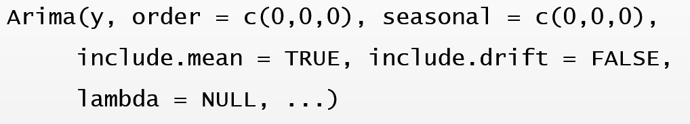
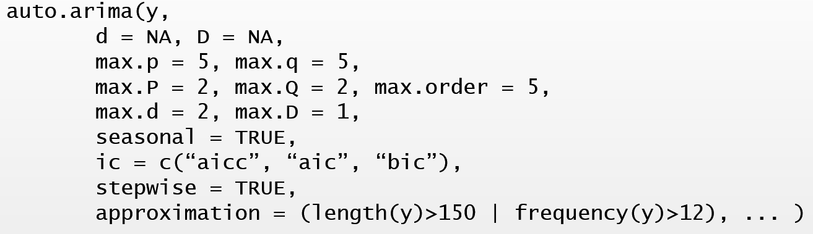

# ARIMA 모형

ARIMA 모형은 ETS 모형과 더불어 가장 많이 사용되는 예측 모형이다.
ETS 모형은 자료에 있는 추세와 계절성분의 형태를 추정하고, 이것을 근거로 예측을 실시하는 방법이다.
이에 반하여 ARIMA 모형은 자료 사이에 존재하는 자기상관함수의 구조를 이용하여 자료의 변동을 설명하고 예측을 실시하는 방법이다.

ARIMA 모형은 `정상성`을 만족하는 자료를 대상으로 적용되는 모형이다.
정상성을 만족하지 않는 자료는 변환 과정을 거쳐서 정상성을 만족시킨 후 모형을 적합하게 된다.

## 시계열자료의 정상성

정상 시계열자료의 특징은 먼저 장기적으로 예측할 뚜렷한 패턴이 없는 것으로 보인다는 것이다.
또한 자료의 진폭도 일정한 것으로 보인다는 것인데, 
이것은 자료의 특성이 관측된 시점과 관계 없이 일정하다는 것이다. 
따라서 추세 또는 계절 변동이 있다면 정상 시계열자료가 아닌 것이다.
Figure \@ref(fig:stationary-1)는 정상 시계열자료의 시계열 그래프이다.

```{r, echo=FALSE}
library(fpp2)
library(tidyverse)
```

```{r stationary-1, fig.cap="정상 시계열자료의 시계열 그래프", echo=FALSE}
set.seed(12)
y <- arima.sim(n = 100, list(order = c(1, 0, 0), ar = 0.5))
autoplot(y) + 
  labs(y = NULL, x = NULL, title = "Stationary time series data")
```

### 정상 시계열자료

-   정상 시계열자료의 조건

시계열자료의 특성이 관측된 시점과 관계 없이 일정하다는 것은 시계열자료 $\{ y_{t}, y_{t+1}, \ldots, y_{t+s}\}$ 의 결합확률분포가 시점 $t$ 와 시차 $s$ 의 값에 관계 없이 항상 동일하다는 것으로 표현할 수 있는데, 이것을 '강한 의미의 정상성 조건'이라고 한다.
시계열자료의 결합 분포가 시간대가 변경되어도 항상 동일하다는 것이 정상성에 대한 정확한 표현이라고 하겠다.
문제는 주어진 자료가 이 조건을 만족하고 있는지 확인하기 상당히 어렵다는 점이다.

만족 여부의 확인이 어렵지 않도록 조건을 약화시켜서 '약한 의미의 정상성 조건'이라고 불리기도 하지만, 일반적으로 통용되는 '정상성 조건'은 다음과 같다.

시계열자료 $y_{t}$ 가 정상 시계열자료가 되기 위해서는 다음의 세 가지 조건을 모두 만족시켜야 한다.

1.  $E(y_{t}) = \mu$ : 시계열자료의 평균이 시점 $t$ 와 관계 없이 일정

2.  $Var(y_{t}) = \sigma^{2}$ : 시계열자료의 분산이 시점 $t$ 와 관계 없이 일정

3.  $Cov(y_{t}, t_{t-k}) = \gamma_{k}$ : 시계열자료의 자기공분산이 시점 $t$ 가 아닌 시차 $k$ 에만 의존

-   정상성 만족 여부 확인 방법

평균이 일정하기 위해서는 추세와 계절 변동이 없어야 하며, 분산이 일정하기 위해서는 자료의 진폭이 일정해야 한다.
따라서 평균과 분산이 일정한지 여부는 시계열 그래프로 확인을 할 수 있을 것이다.
그러나 자기공분산 또는 자기상관이 시차에만 의존한다는 것은 시계열 그래프로는 확인할 수 없는 내용이다.
주어진 시계열자료의 정상성 만족 여부를 확인하기 위해 일반적으로 사용되는 방법은 다음과 같다.

1.  시계열 그래프

특별한 추세 및 계절 변동 요소가 없으며 일정한 폭을 갖고 있는 불규칙 변동인지 확인한다.

2.  표본 ACF 그래프

시차 $k$ 값이 증가함에 따라 $r_{k}$ 값이 빠르게 0으로 수렴하는지 여부를 확인한다.

3.  단위근 검정

정상성 만족 여부를 확인하기 위한 검정으로써, 
특성함수의 근 중에 1이 포함되어 있다는 '비정상성' 가설을 검정한다.
특성함수에 대한 설명은 @cho2015 에서 찾아 볼 수 있다.
단위근 검정에는 다수의 검정방법이 있으며, 
그 중 하나인 KPSS 단위근 검정은 귀무가설이 정상성 만족인 검정으로써 함수 `urca::ur.kpss()`로 진행할 수 있다.

정상성 만족 여부를 확인하기 위해서는 시계열 그래프와 표본 ACF, 그리고 단위근 검정 결과를 함께 고려해야 한다.
3가지 방법이 항상 같은 결과를 보이는 것은 아니기 때문에 주어진 상황에 따라 적절한 판단을 해야할 것이다.

-   정상 시계열자료의 예 : 백색잡음 (White noise)

백색잡음은 대표적인 정상 시계열 모형이다.
확률 변수 $\epsilon_{t}$ 를 서로 독립이고, 평균이 0, 분산이 $\sigma^{2}$ 라고 할 때, $y_{t} = \epsilon_{t}$, $t=1,2,\ldots$ 라고 두면, $y_{t}$는 백색잡음이라고 불리는 정상 시계열자료가 된다.

백색잡음에 해당하는 모의자료를 생성해서 함수 `ggtsdisplay()`로 시계열 그래프와 ACF, PACF를 작성한 것이 Figure \@ref(fig:wn-1)에 있다.

```{r wn-1, fig.cap="정상 시계열 그래프 예: 백색잡음", echo=FALSE}
set.seed(123)
y <- ts(rnorm(100))
ggtsdisplay(y, main = "White noise")
```

### 비정상 시계열 자료의 정상화 {#section-make-stationary}

ARIMA 모형은 정상성을 만족하는 시계열자료만을 대상으로 적용할 수 있기 때문에, 비정상 시계열자료에 대해서는 비정상성 요소를 제거할 수 있는 변환 과정이 필요하다.
정상화 방법에 대해서는 분산이 일정하지 않은 경우와 level이 일정하지 않은 경우로 구분해서 살펴볼 수 있다.
만일 두 가지 비정상 요소가 모두 있는 경우에는 분산 안정화 변환을 먼저 실행해야 한다.

#### 분산이 일정하지 않은 경우

-   Box-Cox 변환

자료의 변동 폭이 level에 따라 달라지는 경우가 있다.
예를 들어, 자료에 추세 성분이 있으며, 그 추세가 증가함에 따라 변동 폭이 함께 증가하는 경우가 많이 있다.
이런 경우에는 자료 $y_{t}$ 를 로그 변환시키면 $w_{t} = \log(y_{t})$, 변환된 자료 $w_{t}$ 의 변동 폭이 일정해지는 효과를 보는 경우가 있다.
로그 변환을 시키면 숫자가 작아지게 되는데, 원자료의 크기가 클수록 줄어드는 정도가 더 커지는 효과가 있으며, 이러한 효과로 자료의 변동 폭을 일정하게 만들 수 있다.
또한 로그 변환은 \@ref(chapter-decomposition)장에서 승법 모형을 가법 모형으로 변환시킬 때 사용했던 변환 방법으로써, 변환의 의미를 해석할 수 있다는 장점이 있다.

다른 방법으로 $w_{t} = y_{t}^{p}$ 형태의 변환인 거듭제곱 변환을 생각해 볼 수 있다.
$p=1/2$ 라 두면 제곱근 변환이 되는데, 로그 변환과 비슷한 효과를 볼 수 있는 변환이다.
로그 변환보다는 원자료의 축소 정도가 작은 변환이어서 변동 폭이 커지는 정도가 상대적으로 작은 경우에 적합한 변환이다.

Figure \@ref(fig:log-sqrt)에서 로그 변환과 제곱근 변환의 효과를 볼 수 있다. 
X축은 원자료 값이고 Y축은 변환된 자료의 값을 나타낸다. 
로그 변환과 제곱근 변환된 자료는 원자료의 값이 증가함에 따라 원자료와 차이가 증가하는 것을 볼 수 있으며,
그 차이는 로그 변환의 경우가 더 크다는 것을 볼 수 있다. 

```{r log-sqrt, fig.cap="로그 변환과 제곱근 변환의 효과", fig.width=4, fig.height=3, fig.align='center', echo=FALSE}
ggplot(data.frame(x = c(1,5)), aes(x)) +
  stat_function(fun = log, aes(color = "로그변환"), size = 1) +
  stat_function(fun = sqrt, aes(color = "제곱근 변환"), size = 1) +
  geom_line(data = tibble::tibble(x = 1:5, y = x), aes(x, y, color = "원자료"), size = 1) +
  xlim(1,5) + ylim(0,5) +
  labs(y = NULL, x = NULL, color = NULL) +
  theme_bw()
```


로그 변환과 제곱근 변환을 포함한 변환 방법으로 Box-Cox 변환이 있다.
이 변환은 변환 모수 $\lambda$ 값에 따라 다음과 같이 정의된다.

```{=tex}
\begin{equation}
w_{t} = 
 \begin{cases}
 \log(y_{t}) & \quad \text{if } \lambda = 0 \\
 (y_{t}^{\lambda}-1)/\lambda & \quad \text{otherwise}
 \end{cases}
\end{equation}
```
Box-Cox 변환은 모든 자료가 양수인 경우에만 적용이 가능한 방법이며, 변환 모수 $\lambda$ 는 최적화 조건에 의해 적정 값을 추정해서 사용하게 된다.

변환을 실행하면, 변환된 자료인 $w_{t}$를 사용하여 모형을 적합하고 예측하게 되는데, 이렇게 예측된 결과는 $y_{t}$ 단위로 역변환을 하게 된다.
예컨대, $w_{t}=\log(y_{t})$ 라면, 
로그 변환된 자료를 사용한 모형의 예측 결과인 $\hat{w}_{T+h}$ 에 역 변환인 지수 변환을 적용한 $\exp(\hat{w}_{T+h})$ 를 최종 예측 결과인 $\hat{y}_{T+h}$ 으로 사용한다는 것이다.
Box-Cox 변환의 효과는 예측값인 $\hat{y}_{T+h}$ 보다는 예측구간에 더 큰 영향을 주게 된다.

-   예제: 호주의 1956년 1월부터 1995년 8월까지 월별 전기 생산량 자료 (`fma::elec`)

분산 안정화 변환이 필요한 자료의 예로써 1956년 1월부터 1995년 8월까지 호주의 월별 전기 생산량 자료인 `fma::elec`을 살펴보자.
시계열 그래프는 Figure \@ref(fig:elec-1)에서 볼 수 있다.

```{r elec-1, fig.cap="`elec` 자료의 시계열 그래프", echo=FALSE}
autoplot(elec) + 
  labs(x = NULL, y = NULL)
```

증가하는 추세가 있으며, 명확한 계절 성분이 있는 자료임을 알 수 있다.
또한 계절 성분의 변동 폭이 추세가 증가함에 따라 함께 증가하는 현상도 볼 수 있다.

Box-Cox 변환을 위한 함수에는 `forecast::BoxCox.lambda()`와 `forecast::BoxCox()`가 있다.
함수 `BoxCox.lambda()`는 변환 모수 $\lambda$ 의 적정 값을 추정하는 기능이 있고, 함수 `BoxCox()`는 입력된 $\lambda$ 값으로 변환을 실시하는 기능이 있다.

이제 `elec` 자료에 대해 Box-Cox 변화을 실시해 보자.

```{r elec-2, fig.cap="`elec` 자료에 Box-Cox 변환 실시"}
(lambda <- BoxCox.lambda(elec))
autoplot(BoxCox(elec, lambda)) + 
  labs(x = NULL, y = NULL)
```

Figure \@ref(fig:elec-2)에서 볼 수 있듯이 Box-Cox 변환된 자료는 전체적으로 일정한 변동 폭을 유지하고 있음을 알 수 있다.
그러나 변환된 자료인 $y_{t}^{0.2654}$ 에 대한 의미가 명확하지 않아서 해석에 문제가 있을 수 있다.
비교 차원에서 로그 변환을 실시해 보고, 결과를 비교해 보자.

```{r elec-3, fig.cap="`elec` 자료에 대한 분산안정화 변환의 비교", echo=FALSE, fig.width=8}
library(patchwork)
p1 <- autoplot(BoxCox(elec, BoxCox.lambda(elec))) + 
  labs(x = NULL, y = NULL, title = "Box-Cox transformation")
p2 <- autoplot(log(elec)) + 
  labs(x = NULL, y = NULL, title = "log transformation")
p1+p2
```

두 변환 결과에는 큰 차이가 없다는 것을 Figure \@ref(fig:elec-3)에서 확인 할 수 있다.
따라서 이 경우에는 승법 모형을 가법 모형으로 변환한다는 의미를 갖고 있어서 해석이 비교적 용이한 로그 변환을 사용하는 것이 더 좋을 것으로 보인다.

#### 자료의 level이 일정하지 않은 경우

자료의 level이 일정하지 않다는 것은 추세 성분과 계절 성분이 있다는 것을 의미한다.
이런 경우에는 차분을 실시하여 비정상 요소를 제거하게 된다.

-   차분

차분이란 연속된 자료의 차이를 의미하는 것으로써 다음과 같이 정의된다.

$$
\nabla y_{t} = y_{t} - y_{t-1}
$$ 차분을 실시하면 선형 추세를 제거할 수 있다.
만일 $y_{t} = a + bt$ 라면, $\nabla y_{t} = (a + bt) - (a + b(t-1)) = b$ 가 되어 추세가 제거된 자료가 생성된다.
원자료의 개수가 $T$ 개라면, 차분된 자료의 개수는 첫 번째 자료가 누락되어서 $T-1$ 개가 된다.

차분을 실시해야 하는 경우에는 일반적으로 표본 ACF에서 $r_{1}$ 이 큰 값을 갖고 있으며, $r_{k}$ 가 매우 천천히 감소하는 모습을 볼 수 있다.

차분된 자료에 여전히 추세 성분이 남아 있는 경우가 있을 수 있다.
이런 현상은 추세 성분이 2차 곡선의 형태를 갖는 경우에 발생할 수 있다.
이런 경우에는 차분된 자료에 두 번째 차분을 실시하면 남아 있는 추세 성분을 제거할 수 있다.

```{=tex}
\begin{align*}
\nabla^{2} y_{t} &= \nabla y_{t} - \nabla y_{t-1} \\
                 &= (y_{t}-y_{t-1})-(y_{t-1}-y_{t-2}) \\
                 &= y_{t} - 2y_{t-1} + y_{t-2}
\end{align*}
```
2차 차분을 실시하면 처음 두 자료가 누락되어 자료의 개수는 $T-2$ 개가 된다.

-   계절 차분

주기가 $m$ 인 계절 성분이 존재하면, $m$ 시차 떨어진 자료들 사이에 강한 상관 관계가 존재하게 된다.
따라서 이러한 계절 성분을 제거하기 위해서는 $m$ 시차 떨어진 자료들 사이의 차이를 계산하는 계절 차분을 실시해야 한다.

$$
\nabla_{m} ~y_{t} = y_{t} - y_{t-m}
$$ 예를 들어 $m=12$ 인 자료의 경우에, 계절 차분이란 연속된 두 연도의 월별 자료 차이를 의미하는 것이다.
계절 차분된 자료는 처음 $m$ 개의 자료가 누락되어 자료 개수는 $T-m$ 개가 된다.

계절 성분이 강하게 존재하게 되면, 계절 주기 $m$의 배수인 $m, 2m, \ldots$ 에서 표본 ACF $r_{k}$ 가 천천히 감소하는 형태를 보이게 된다.

강한 추세와 계절 성분이 모두 존재하는 경우에는 차분과 계절 차분을 모두 실시해야 비정상 요소를 제거할 수 있게 된다.

$$
\nabla \nabla_{m} ~y_{t} = (y_{t}-y_{t-m})-(y_{t-1}-y_{t-m-1})
$$

이 때 계절 차분과 차분 중 어떤 것을 먼저 실시하든지 결과는 동일하다.
그러나 강한 계절 성분이 있는 경우 계절 차분을 먼저 실시하면 추세가 함께 제거되는 경우도 있다.

-   후진작용소

후진작용소 $B$ 는 시차를 사용해야 하는 경우에 매우 유용하게 사용되는 기호이며, 다음과 같이 정의된다.
$$
By_{t} = y_{t-1}
$$ 즉, $B$ 가 $y_{t}$ 에 적용되면 시점을 하나 뒤로 옮기는 역할을 한다.
두 시점 뒤로 옮기는 작업은 후진 작용소를 두 번 적용시키면 된다.

$$
B(By_{t})=B^{2}y_{t}=y_{t-2}
$$ 월별 자료의 경우에 이전 연도의 동일한 월 시점으로 옮기는 것은 $B^{12}y_{t}=y_{t-12}$ 로 나타낼 수 있다.
또한 차분을 후진작용소를 이용해서 표현할 수 있는데, 1차 차분은

$$
\nabla y_{t} = y_{t} - y_{t-1} = y_{t} - By_{t} = (1-B)y_{t} 
$$ 가 되고, 2차 차분은

$$
\nabla^{2} y_{t} = (1-B)^{2} y_{t}
$$ 가 되며, 계절 차분은

$$
\nabla_{m} ~y_{t} = y_{t} - y_{t-m} = y_{t} - B^{m}y_{t} = (1-B^{m})y_{t}
$$

가 된다.

-   비정상 시계열자료의 예

대표적인 비정상 시계열 모형으로 확률보행 (Random walk) 모형이 있다.
확률보행 모형은 절편이 있는 모형과 절편이 없는 모형으로 구분할 수 있으며, 절편이 없는 확률보행 모형은 다음과 같이 정의된다.

$$
y_{t} = y_{t-1} + \epsilon_{t}
$$ 단, $\epsilon_{t}$ 는 백색잡음이다.
따라서 절편이 없는 확률보행 자료에 차분을 실시하면 백색잡음이 된다.

또한 절편이 있는 확률보행 모형은 다음과 같다.

$$
y_{t} = \delta + y_{t-1} + \epsilon_{t}
$$ 확률보행 자료의 일반적인 시계열 그래프 형태는 일정 기간 동안 상승하거나 하강하는 추세를 보이지만, 갑작스런 추세 방향의 전환이 발생할 수 있다.
절편이 있는 확률보행의 경우에는 절편의 크기가 충분히 큰 경우에는 계속적인 상승 혹은 하강하는 추세를 보일 수 있다.
확률보행 자료의 경우에는 효과적인 예측 방법이 존재하지 않는다.
자료를 차분하면 순수 random 요소만 남기 때문인데, 따라서 naive forecast $(\hat{y}_{t+1}=y_{t})$ 가 유일하게 사용할 수 있는 예측 방법이 된다.

확률보행 모형에서 모의 자료를 발생시켜 시계열 그래프와 표본 ACF를 작성해 보자.
먼저 Figure \@ref(fig:rw-1)는 절편이 없는 확률보행 자료의 경우이다.
감소하다 갑자기 증가하는 추세가 있으며, 표본 ACF가 매우 천천히 감소하는 것을 볼 수 있다.

```{r rw-1, fig.cap="절편이 없는 확률보행 자료 예", fig.width=8, echo=FALSE}
library(patchwork)
set.seed(1234)
y1 <- arima.sim(list(order = c(0,1,0)), n = 200)
p1 <- autoplot(y1) + labs(title = "Random walk", y = NULL)
p2 <- ggAcf(y1) + ggtitle("")
p1 + p2
```

다음에 Figure \@ref(fig:rw-2)는 절편이 있는 확률보행 자료의 경우이다.
절편이 양수인 경우이며, 백색잡음의 변동 폭에 비해 충분히 큰 값을 지정했다.
계속적인 증가 추세가 있으며 표본 ACF는 매우 천천히 감소하는 것을 볼 수 있다.

```{r rw-2, fig.cap="절편이 있는 확률보행 자료 예", fig.width=8, echo=FALSE}
set.seed(123)
y2 <- arima.sim(list(order = c(0,1,0)), n = 200)
y2 <- y2 + 0.15*(seq_along(y2))
p3 <- autoplot(y2) + labs(title = "Random walk with drift", y = NULL)
p4 <- ggAcf(y2) + ggtitle("")
p3 + p4
```

-   예제 : Google 주가 자료 (`fpp2::goog200`)

Google 주가 자료인 `goog200`의 시계열 그래프와 표본 ACF를 작성해 보자.
대체적으로 증가하는 추세가 있으며, 표본 ACF가 매우 천천히 감소하고 있다.

```{r goog200-1, fig.cap="`goog200` 자료의 시계열 그래프와 ACF", fig.width=8, echo=FALSE}
p1 <- autoplot(goog200) + labs(x = NULL, y = NULL, title = "Google stock price")
p2 <- ggAcf(goog200) + ggtitle("")
p1 + p2
```

차분을 실시하기 위해 사용할 함수는 `diff()`이다.
사용법은 `diff(x, lag = 1, differences = 1)`이며, `x`는 차분하려는 자료이고, `lag`에는 차분 시차를 지정하는데, 디폴트는 1차 차분이고 계절 차분을 원한다면 계절 주기를 입력하면 된다.
또한 `differences`는 차분 차수를 지정하는 것으로써, 만일 `lag = 1`이고 `differences = 2`가 되면 2차 차분 $(1-B)^{2}y_{t}$ 가 계산된다.

이제 `goog200` 자료를 1차 차분하고 결과를 확인해 보자.

```{r goog200-2, fig.cap="`goog200`의 1차 차분된 자료의 시계열 그래프와 ACF", fig.width=8, echo=FALSE}
goog200_1 <- diff(goog200)
p3 <- autoplot(goog200_1) + labs(x = NULL, y = NULL, title = "Google stock price")
p4 <- ggAcf(goog200_1) + ggtitle("")
p3 + p4
```

차분된 자료는 하나의 이상값을 제외하면 일정한 level을 유지하고 있으며, 표본 ACF의 모든 값들이 신뢰구간 안에 존재하고 있음을 알 수 있다.
따라서 차분된 자료는 백색잡음 자료로 보이며, 이것은 원자료가 확률보행 자료임을 나타내는 것이 된다.

`goog200` 자료를 대상으로 단위근 검정을 실시해 보자.
단위근 검정은 `urca::ur.kpss()`로 실시할 수 있지만, 함수 `forecast::ndiffs()`를 사용하면 정상성을 만족시키기 위한 차분의 횟수를 단위근 검정에 근거를 두고 추정해 준다.

```{r}
ndiffs(goog200)
```

즉, 1차 차분을 실시하면 정상성을 만족시킬 수 있다고 제안하는 것이다.
물론 `urca::ur.kpss()`로 단위근 검정을 실시해서 주어진 자료의 정상성 여부를 확인할 수 있다.

```{r, message=FALSE}
library(urca)
library(tidyverse)
goog200 %>% 
  ur.kpss() %>% 
  summary()
```

계산된 검정 통계량 값이 1% 유의수준의 임계값보다 크기 때문에 정상이라는 귀무가설을 기각할 수 있다.
1차 차분을 실시한 자료를 대상으로 단위근 검정을 실시해 보면, 귀무가설을 기각할 수 없기 때문에 1차 차분으로 정상성을 확보했다고 볼 수 있다.

```{r}
goog200 %>% 
  diff() %>% 
  ur.kpss() %>% 
  summary()
```

-   예제 : 호주의 1956년 1월부터 1995년 8월까지 월별 전기 생산량 자료 (`fma::elec`)

Figure \@ref(fig:elec-1)에서 살펴본 `elec`는 증가하는 추세와 뚜렷한 계절 성분이 있으며, 
분산이 시간이 흐름에 따라 증가하는 자료이다.
정상성을 만족시키기 위한 변환 절차에서 분산 안정화는 항상 가장 먼저 시행해야 한다.
로그 변환을 시행해서 분산을 안정화 시킨 자료의 시계열 그래프와 ACF를 작성해 보자.

```{r elec-d1, fig.cap="`elec`에 로그 변환한 자료의 시계열 그래프와 ACF", fig.width=8, echo=FALSE}
ln_elec <- log(elec)
p1 <- autoplot(ln_elec) + labs(x = NULL, y = NULL, title = "log transformed data")
p2 <-  ggAcf(ln_elec) + ggtitle("")
p1 + p2
```

계절 성분을 제거하기 위해 계절 차분을 실시할 필요가 있는 것으로 보인다.
계절 차분의 경우에는 함수 `forecast::nsdiffs()`를 사용하면 계절 단위근 검정을 근거로 하여 계절 차분 횟수를 추정할 수 있다.\
함수 `nsdiffs()`는 seasonal strength를 측정하는 통계량을 근거로 하여 차분 횟수를 추정하는 것이 디폴트이다.

```{r}
elec %>% 
  log() %>% 
  nsdiffs()
```

계절 차분을 실시한 자료를 대상으로 시계열 그래프와 ACF를 작성해 보자.

```{r elec-d2,  fig.cap="로그 변환된`elec`에 계절차분을 실시한 자료의 시계열 그래프와 ACF", fig.width=8, echo=FALSE}
ln_elec_m <- log(elec) %>% 
  diff(lag = 12)
p3 <- autoplot(ln_elec_m) + labs(x = NULL, y = NULL, title = "log transformed and seasonally differenced data")
p4 <-  ggAcf(ln_elec_m) + ggtitle("")
p3 + p4
```

Figure \@ref(fig:elec-d2)에서 볼 수 있듯이 추세 성분이 아직 남아 있는 것으로 보인다.
이제 계절 차분된 자료에 1차 차분을 더 실시해서 결과를 살펴보자.
Figure \@ref(fig:elec-d3)에 나타난 패턴을 보면, 비정상 요소가 모두 제거되었음을 알 수 있다.

```{r elec-d3,  fig.cap="로그 변환된`elec`에 계절차분과 1차 차분을 실시한 자료의 시계열 그래프와 ACF", fig.width=8, echo=FALSE}
ln_elec_m_1 <- log(elec) %>% 
  diff(lag = 12) %>% 
  diff()
p5 <- autoplot(ln_elec_m_1) + labs(x = NULL, y = NULL, title = "log transformed and doubly differenced data")
p6 <-  ggAcf(ln_elec_m_1) + ggtitle("")
p5 + p6
```


## 정상 시계열 모형

ARIMA 모형을 구성하고 있는 정상 시계열 자료를 위한 세 가지 모형은 다음과 같다.

-   자기회귀 (Autoregressive; AR) 모형

-   이동평균 모형 (Moving average; MA) 모형

-   자기회귀이동평균 (Autoregressive Moving average; ARMA) 모형

### 자기회귀모형 (Autoregressive model; AR model)

과거 자료의 선형 결합으로 미래 자료를 예측하려는 모형으로써,
$p$ 차 자기회귀 모형 또는 AR(p)라고 불리는 모형은 다음과 같이 표현된다.

$$
y_{t} - \mu = \phi_{1}(y_{t-1}-\mu) + \cdots + \phi_{p}(y_{t-p}-\mu) + \epsilon_{t}
$$ 단, $\epsilon_{t}$ 는 평균이 0이고 분산이 $\sigma^{2}$ 인 백색잡음, 즉 $\epsilon_{t} \sim WN(0, \sigma^{2})$ , 이고 $E(y_{t}) = \mu$ 이다.

또한 평균 $\mu$ 를 절편의 형식으로 정리한 표현식은 다음과 같다.

$$
y_{t} = \delta + \phi_{1}y_{t-1} + \cdots + \phi_{p}y_{t-p} + \epsilon_{t}  (#eq:ar-delta)
$$ 단, $\delta = \mu(1-\phi_{1}- \cdots -\phi_{p})$ .

시계열자료 $y_{t}$ 가 과거 시점 자료인 $y_{t-1}, y_{t-2}, \ldots, y_{t-p}$ 의 선형결합으로 나타낼 수 있음을 알 수 있다.
따라서 자기회귀, 즉 자기 자신의 과거 값과의 회귀라는 용어로 표현할 수 있는 것이다.

후진작용소에 의한 표현식은 식 \@ref(eq:ar-delta)에서 다음과 같이 유도할 수 있다.

```{=tex}
\begin{align*}
y_{t} - \phi_{1}y_{t-1} - \cdots - \phi_{p}y_{t-p} &= \delta + \epsilon_{t} \\
(1-\phi_{1}B- \cdots - \phi_{p}B^{p})y_{t} &= \delta + \epsilon_{t} \\
\phi(B)y_{t} &= \delta + \epsilon_{t}
\end{align*}
```
단, $\phi(B) = 1 - \phi_{1}B - \cdots - \phi_{p}B^{p}$

-   AR(1) 모형 : $y_{t} = \delta + \phi_{1} y_{t-1} + \epsilon_{t}$

AR(1) 모형에서는 현 시점의 자료가 1시차 이전 자료와 직접적인 관련이 있고, 그 이전 시점의 자료와는 직접적인 연관이 없는 모형이다.
자료의 형태는 모수 $\phi_{1}$ 값에 따라 달라지게 된다.
예를 들어, $\mu = 0$ 를 가정한 상태에서 $\phi_{1} = 0.8$ 과 $\phi_{1} = -0.8$ 인 경우에 대한 모의자료를 발생시켜 작성한 시계열 그래프가 Figure \@ref(fig:ar1-1)이다.

```{r ar1-1, fig.cap="AR(1) 모형에서 발생시킨 모의자료 시계열 그래프", echo=FALSE, fig.width=8}
library(patchwork)
set.seed(123)
y1 <- arima.sim(n=100, list(order=c(1,0,0), ar=0.8))
y2 <- arima.sim(n=100, list(order=c(1,0,0), ar=-0.8))
p1 <- autoplot(y1) + 
  labs(title = expression(paste("AR(1) with",~~phi==0.8)), y = NULL)
p2 <- autoplot(y2) + 
  labs(title = expression(paste("AR(1) with",~~phi==-0.8)), y = NULL)
p1 + p2
```

AR(1) 모형에서 $\phi_{1} > 0$ 인 경우에는, 일단 양의 값 (또는 음의 값)이 되면 일정 기간 지속되는 경향이 있음을 알 수 있고, $\phi_{1} < 0$ 인 경우에는, 양의 값과 음의 값이 번갈아 반복되는 경향이 있음을 알 수 있다.
이것은 AR(1) 모형의 1차 자기상관계수, $\rho_{1}$ 이 $y_{t-1}$ 의 계수인 $\phi_{1}$ 과 같기 때문이다.

AR(1) 모형은 $\phi_{1}$ 의 값에 따라서 다른 모형과 동일한 모형이 되는데, $\phi_{1} = 0$ 이면, $y_{t} = \epsilon_{t}$ 가 되어 백색잡음 모형이 되고, $\phi_{1} = 1, \delta = 0$ 이면, $y_{y} = y_{t-1} + \epsilon_{t}$ 가 되어, 절편이 없는 확률보행 모형이 되고, $\phi_{1} = 1, \delta \ne 0$ 이면, $y_{y} = \delta + y_{t-1} + \epsilon_{t}$ 가 되어, 절편이 있는 확률보행 모형이 된다.

이렇듯 AR(1) 모형은 $\phi_{1}$ 값에 따라서 정상 시계열 모형 또는 비정상 시계열 모형이 된다.
따라서 AR(1) 모형이 정상 시계열 모형이 되기 위해서는 '정상성 조건'을 만족시켜야 한다.
AR(1) 모형에서의 정상성 조건은 $-1<\phi_{1}<1$ 이다.

AR(1) 모형의 이론적 ACF와 PACF의 형태를 살펴보자.
$\phi_{1} = 0.8$ 인 경우에 대한 이론적 ACF와 PACF가 Figure \@ref(fig:ar1-2)에 있다.
ACF는 지수적으로 감소하는 형태를 취하고 있고, PACF는 1시차 이후에는 0이 되는 절단 현상을 보이고 있다.

```{r ar1-2, fig.cap="AR(1) 모형의 이론적 ACF, PACF", echo=FALSE, fig.width=8}
library(patchwork)
acf_ar1 <- function(phi,k){
  res <- vector("numeric", k)
  for(i in seq_along(res)) res[i] <- phi^(i)
  return(res)
}
pacf_ar1 <- function(phi,k){
  res <- vector("numeric", k) 
  for(i in seq_along(res)) res[i] <- ifelse(i==1,phi,0)
  return(res)
}

p <- 0.8
lag_k <- 10
acf_end <- acf_ar1(p, lag_k)
pacf_end <- pacf_ar1(p, lag_k)

p1 <- ggplot(data.frame(x=1:lag_k, y=0), aes(x,y)) +
  geom_segment(aes(xend=x,yend=acf_end), size=3) + 
  geom_hline(aes(yintercept=0)) +
  scale_x_continuous(breaks=1:lag_k) +
  scale_y_continuous(limits=c(-1,1)) +
  labs(x="Lag", y=NULL, title=expression(paste("ACF of AR(1) with",~~phi==0.8))) +
  theme_bw()

p2 <- ggplot(data.frame(x=1:lag_k, y=0), aes(x,y)) +
  geom_segment(aes(xend=x,yend=pacf_end), size=3) + 
  geom_hline(aes(yintercept=0)) +
  scale_x_continuous(breaks=1:lag_k) +
  scale_y_continuous(limits=c(-1,1)) +
  labs(x="Lag", y=NULL, title=expression(paste("PACF of AR(1) with",~~phi==0.8))) +
  theme_bw()
p1+p2
```

$\phi_{1} = -0.8$ 인 경우에 대한 이론적 ACF와 PACF가 Figure \@ref(fig:ar1-3)에 있다.
ACF는 양과 음의 값을 번갈아 가지며 지수적으로 감소하고 있고, PACF는 1시차 이후 절단된 모습이다.

```{r ar1-3, fig.cap="AR(1) 모형의 이론적 ACF, PACF", echo=FALSE, fig.width=8}
library(patchwork)
acf_ar1 <- function(phi,k){
  res <- vector("numeric", k)
  for(i in seq_along(res)) res[i] <- phi^(i)
  return(res)
}
pacf_ar1 <- function(phi,k){
  res <- vector("numeric", k) 
  for(i in seq_along(res)) res[i] <- ifelse(i==1,phi,0)
  return(res)
}

p <- -0.8
lag_k <- 10
acf_end <- acf_ar1(p, lag_k)
pacf_end <- pacf_ar1(p, lag_k)

p1 <- ggplot(data.frame(x=1:lag_k, y=0), aes(x,y)) +
  geom_segment(aes(xend=x,yend=acf_end), size=3) + 
  geom_hline(aes(yintercept=0)) +
  scale_x_continuous(breaks=1:lag_k) +
  scale_y_continuous(limits=c(-1,1)) +
  labs(x="Lag", y=NULL, title=expression(paste("ACF of AR(1) with",~~phi==-0.8))) +
  theme_bw()

p2 <- ggplot(data.frame(x=1:lag_k, y=0), aes(x,y)) +
  geom_segment(aes(xend=x,yend=pacf_end), size=3) + 
  geom_hline(aes(yintercept=0)) +
  scale_x_continuous(breaks=1:lag_k) +
  scale_y_continuous(limits=c(-1,1)) +
  labs(x="Lag", y=NULL, title=expression(paste("PACF of AR(1) with",~~phi==-0.8))) +
  theme_bw()
p1+p2
```

-   AR(2) 모형: $y_{t} = \delta + \phi_{1}y_{t-1} + \phi_{2} y_{t-2} + \epsilon_{t}$

AR(2) 모형에서 $y_{t}$ 는 $y_{t-1}$ 과 $y_{t-2}$ 의 선형결합으로 표현된다.
즉, 현 시점의 자료는 가장 최근 두 시점의 자료와 직접적인 관련이 있고, 그 이전 시점의 자료는 간접적인 관련만 있다는 것을 의미한다.
따라서 직접적인 상관 관계를 측정하는 부분상관계수는 AR(2) 모형의 경우에는 2시차 이후에는 0의 값을 갖게 된다.

AR(2) 모형의 정상성 조건은 $-1<\phi_{2}<1$ , $\phi_{1} + \phi_{2} <1$ , $\phi_{2}-\phi_{1} <1$ 이다.

AR(2) 모형의 이론적 ACF와 PACF의 형태를 살펴보자.
$\phi_{1}$ 과 $\phi_{2}$ 값의 조합에 따라 다른 형태를 보이는데, 차이가 나는 것은 ACF의 형태이고 PACF는 항상 2시차 이후 절단 형태를 보인다.
이론적 ACF의 첫 번째 유형은 지수적 감소이고, 두 번째 유형은 소멸하는 sine 함수 형태이다.
Figure \@ref(fig:ar2-1)는 $\phi_{1} = -0.5, \phi_{2} = 0.2$ 의 모형에 대한 것이고, Figure \@ref(fig:ar2-2)는 $\phi_{1} = 0.7, \phi_{2} = 0.2$의 모형에 대한 것이다.
두 경우 모두 첫 번째 ACF 유형인 지수적 감소 형태이다.

```{r ar2-1, fig.cap="AR(2) 모형의 이론적 ACF, PACF", echo=FALSE, fig.width=8}
library(patchwork)
acf_ar2 <- function(phi1,phi2,k){
  res <- numeric(k)
  res[1] <- phi1/(1-phi2)
  res[2] <- (phi1^2+phi2-phi2^2)/(1-phi2)
  for(i in 3:k) res[i] <- phi1*res[i-1]+phi2*res[i-2]
  return(res)
}

pacf_ar2 <- function(phi1,phi2,k){
  res <- numeric(k)
  res[1] <- phi1/(1-phi2)
  res[2] <- phi2
  return(res)
}
p1 <- -0.5
p2 <- 0.2
lag_k <- 10
acf_end <- acf_ar2(p1, p2, lag_k)
pacf_end <- pacf_ar2(p1, p2, lag_k)

p3 <- ggplot(data.frame(x=1:lag_k, y=0), aes(x,y)) +
  geom_segment(aes(xend=x,yend=acf_end), size=3) + 
  geom_hline(aes(yintercept=0)) +
  scale_x_continuous(breaks=1:lag_k) +
  scale_y_continuous(limits=c(-1,1)) +
  labs(x="Lag", y=NULL, title="ACF of AR(2)") + theme_bw()

p4 <- ggplot(data.frame(x=1:lag_k, y=0), aes(x,y)) +
  geom_segment(aes(xend=x,yend=pacf_end), size=3) + 
  geom_hline(aes(yintercept=0)) +
  scale_x_continuous(breaks=1:lag_k) +
  scale_y_continuous(limits=c(-1,1)) +
  labs(x="Lag", y=NULL, title="PACF of AR(2)") + theme_bw()
p3+p4
```

```{r ar2-2, fig.cap="AR(2) 모형의 이론적 ACF, PACF", echo=FALSE, fig.width=8}
library(patchwork)

p1 <- 0.7
p2 <- 0.2
lag_k <- 10
acf_end <- acf_ar2(p1, p2, lag_k)
pacf_end <- pacf_ar2(p1, p2, lag_k)

p3 <- ggplot(data.frame(x=1:lag_k, y=0), aes(x,y)) +
  geom_segment(aes(xend=x,yend=acf_end), size=3) + 
  geom_hline(aes(yintercept=0)) +
  scale_x_continuous(breaks=1:lag_k) +
  scale_y_continuous(limits=c(-1,1)) +
  labs(x="Lag", y=NULL, title="ACF of AR(2)") + theme_bw()

p4 <- ggplot(data.frame(x=1:lag_k, y=0), aes(x,y)) +
  geom_segment(aes(xend=x,yend=pacf_end), size=3) + 
  geom_hline(aes(yintercept=0)) +
  scale_x_continuous(breaks=1:lag_k) +
  scale_y_continuous(limits=c(-1,1)) +
  labs(x="Lag", y=NULL, title="PACF of AR(2)") + theme_bw()
p3+p4
```

Figure \@ref(fig:ar2-3)는 $\phi_{1} = -0.8, \phi_{2} = -0.7$ 의 모형에 대한 것이고, Figure \@ref(fig:ar2-4)는 $\phi_{1} = 1.3, \phi_{2} = -0.6$의 모형에 대한 것이다.
두 경우 모두 두 번째 ACF 유형인 소멸하는 sine 함수 형태이다.

```{r ar2-3, fig.cap="AR(2) 모형의 이론적 ACF, PACF", echo=FALSE, fig.width=8}
library(patchwork)

p1 <- -0.8
p2 <- -0.7
lag_k <- 10
acf_end <- acf_ar2(p1, p2, lag_k)
pacf_end <- pacf_ar2(p1, p2, lag_k)

p3 <- ggplot(data.frame(x=1:lag_k, y=0), aes(x,y)) +
  geom_segment(aes(xend=x,yend=acf_end), size=3) + 
  geom_hline(aes(yintercept=0)) +
  scale_x_continuous(breaks=1:lag_k) +
  scale_y_continuous(limits=c(-1,1)) +
  labs(x="Lag", y=NULL, title="ACF of AR(2)") + theme_bw()

p4 <- ggplot(data.frame(x=1:lag_k, y=0), aes(x,y)) +
  geom_segment(aes(xend=x,yend=pacf_end), size=3) + 
  geom_hline(aes(yintercept=0)) +
  scale_x_continuous(breaks=1:lag_k) +
  scale_y_continuous(limits=c(-1,1)) +
  labs(x="Lag", y=NULL, title="PACF of AR(2)") + theme_bw()
p3+p4
```

```{r ar2-4, fig.cap="AR(2) 모형의 이론적 ACF, PACF", echo=FALSE, fig.width=8}
library(patchwork)

p1 <- 1.3
p2 <- -0.6
lag_k <- 10
acf_end <- acf_ar2(p1, p2, lag_k)
pacf_end <- pacf_ar2(p1, p2, lag_k)

p3 <- ggplot(data.frame(x=1:lag_k, y=0), aes(x,y)) +
  geom_segment(aes(xend=x,yend=acf_end), size=3) + 
  geom_hline(aes(yintercept=0)) +
  scale_x_continuous(breaks=1:lag_k) +
  scale_y_continuous(limits=c(-1,1)) +
  labs(x="Lag", y=NULL, title="ACF of AR(2)") + theme_bw()

p4 <- ggplot(data.frame(x=1:lag_k, y=0), aes(x,y)) +
  geom_segment(aes(xend=x,yend=pacf_end), size=3) + 
  geom_hline(aes(yintercept=0)) +
  scale_x_continuous(breaks=1:lag_k) +
  scale_y_continuous(limits=c(-1,1)) +
  labs(x="Lag", y=NULL, title="PACF of AR(2)") + theme_bw()
p3+p4
```

-   AR(p) 모형, $p \geq 3$

3차 이상의 차수를 갖는 AR 모형의 경우에는 정상성 조건이 매우 복잡한 형태가 된다.
그러나 R 함수가 정상성 조건을 고려해서 모수를 추정하기 때문에 사용자가 일일이 확인할 필요는 없다.

AR(p) 모형의 이론적 ACF와 PACF의 형태는 AR(2)의 경우와 유사한 패턴을 보이게 되는데, ACF는 지수적 감소 혹은 소멸하는 sine 함수의 형태를 취하고 있고, PACF는 p 시차까지는 0이 아닌 값을 갖고 있지만 그 이후에는 0이 되는 절단 현상을 보이게 된다.
따라서 AR(p) 모형의 경우에는 PACF를 이용하여 차수 p를 인식할 수 있게 된다.

### 이동평균모형 (Moving average model; MA model)

$q$ 차 이동평균모형 혹은 MA(q)라고 불리는 모형은 다음과 같이 표현된다.

```{=tex}
\begin{align*}
y_{t}-\mu &= \epsilon_{t} + \theta_{1}\epsilon_{t-1} + \cdots + \theta_{q}\epsilon_{t-q} \\
          &= (1+\theta_{1}B + \cdots + \theta_{q}B^{q}) \epsilon_{t} \\
          &= \theta(B)\epsilon_{t}
\end{align*}
```
단, $\theta(B) = 1 + \theta_{1}B + \cdots + \theta_{q}B^{q}$ 이고, $\epsilon \sim WN(0, \sigma^{2})$ 이며, $E(y_{t})=\mu$ 이다.

MA(q) 모형은 현 시점의 백색잡음 오차와 과거 $q$ 시차까지의 백색잡음 오차의 선형결합으로 표현된다.
유한개의 백색잡음의 선형결합이기 때문에 정상성은 항상 만족된다.

분해법에서 추세 성분 추정에 사용되었던 Moving average smoothing과는 명칭이 비슷해서 혼동될 수 있지만 전혀 다른 모형이다.

-   MA(1) 모형 : $y_{t} - \mu = \epsilon_{t} + \theta_{1}\epsilon_{t-1} = (1+\theta_{1}B)\epsilon_{t}$

MA(1) 모형에서 생성된 자료의 형태는 모수 $\theta_{1}$ 값에 따라 달라지게 된다.
예를 들어, $\mu = 0$ 를 가정한 상태에서 $\theta_{1} = 0.8$ 과 $\theta_{1} = -0.8$ 인 경우에 대한 모의자료를 발생시켜 작성한 시계열 그래프가 Figure \@ref(fig:ma1-1)이다.

```{r ma1-1, fig.cap="MA(1) 모형에서 발생시킨 모의자료 사계열 그래프", echo=FALSE, fig.width=8}
library(patchwork)
set.seed(1234)
y1 <- arima.sim(n = 100, list(order = c(0,0,1), ma = 0.8))
y2 <- arima.sim(n = 100, list(order = c(0,0,1), ma = -0.8))
p1 <- autoplot(y1) + 
  labs(title = expression(paste("MA(1) with",~~theta==0.8)), y = NULL)
p2 <- autoplot(y2) + 
  labs(title = expression(paste("MA(1) with",~~theta==-0.8)), y = NULL)
p1+p2
```

AR(1) 모형에서 관찰된 것과 매우 흡사한 패턴을 MA(1)에서도 볼 수 있다.
$\theta_{1} > 0$ 인 경우에는 일단 양의 값 (혹은 음의 값)이 되면 일정 기간 지속되는 경향이 있으며, $\theta_{1} < 0$ 인 경우에는 양과 음의 값이 번갈아 반복되는 경향이 있음을 알 수 있다.

MA(1) 모형의 이론적 ACF와 PACF의 형태를 살펴보자.
$\theta_{1} = 0.8$ 인 경우에 대한 이론적 ACF와 PACF가 Figure \@ref(fig:ma1-2)에 있다.
ACF는 1시차 이후 절단 현상을 보이고 있고, PACF는 양과 음의 값을 번갈아 가지며 지수적인 감소 형태를 취하고 있다.

```{r ma1-2, fig.cap="MA(1) 모형의 이론적 ACF, PACF", echo=FALSE, fig.width=8}
acf_ma1 <- function(theta,k){
  res <- vector("numeric", k)
  res[1] <- theta/(1+theta^2)
  return(res)
}
pacf_ma1 <- function(theta,k){
  res <- vector("numeric", k) 
  for(i in seq_along(res)) res[i] <- ((-1)^(i+1)*(theta^i)*(1-theta^2))/(1-theta^(2*(i+1)))
  return(res)
}

theta <- 0.8
lag_k <- 10
acf_end <- acf_ma1(theta, lag_k)
pacf_end <- pacf_ma1(theta, lag_k)

p1 <- ggplot(data.frame(x=1:lag_k, y=0), aes(x,y)) +
  geom_segment(aes(xend=x,yend=acf_end), size=3) + 
  geom_hline(aes(yintercept=0)) +
  scale_x_continuous(breaks=1:lag_k) +
  scale_y_continuous(limits=c(-1,1)) +
  labs(x="Lag", y=NULL, title=expression(paste("ACF of MA(1) with",~~theta==0.8))) +
  theme_bw()

p2 <- ggplot(data.frame(x=1:lag_k, y=0), aes(x,y)) +
  geom_segment(aes(xend=x,yend=pacf_end), size=3) + 
  geom_hline(aes(yintercept=0)) +
  scale_x_continuous(breaks=1:lag_k) +
  scale_y_continuous(limits=c(-1,1)) +
  labs(x="Lag", y=NULL, title=expression(paste("PACF of MA(1) with",~~theta==0.8))) +
  theme_bw()

p1+p2
```

$\theta_{1} = -0.8$ 인 경우에 대한 이론적 ACF와 PACF는 Figure \@ref(fig:ma1-3)에 있다.
ACF는 1시차 이후 절단 현상을 보이고 있고, PACF는 지수적인 감소 형태를 취하고 있다.

```{r ma1-3, fig.cap="MA(1) 모형의 이론적 ACF, PACF", echo=FALSE, fig.width=8}
acf_ma1 <- function(theta,k){
  res <- vector("numeric", k)
  res[1] <- theta/(1+theta^2)
  return(res)
}
pacf_ma1 <- function(theta,k){
  res <- vector("numeric", k) 
  for(i in seq_along(res)) res[i] <- ((-1)^(i+1)*(theta^i)*(1-theta^2))/(1-theta^(2*(i+1)))
  return(res)
}

theta <- -0.8
lag_k <- 10
acf_end <- acf_ma1(theta, lag_k)
pacf_end <- pacf_ma1(theta, lag_k)

p1 <- ggplot(data.frame(x=1:lag_k, y=0), aes(x,y)) +
  geom_segment(aes(xend=x,yend=acf_end), size=3) + 
  geom_hline(aes(yintercept=0)) +
  scale_x_continuous(breaks=1:lag_k) +
  scale_y_continuous(limits=c(-1,1)) +
  labs(x="Lag", y=NULL, title=expression(paste("ACF of MA(1) with",~~theta==-0.8))) +
  theme_bw()

p2 <- ggplot(data.frame(x=1:lag_k, y=0), aes(x,y)) +
  geom_segment(aes(xend=x,yend=pacf_end), size=3) + 
  geom_hline(aes(yintercept=0)) +
  scale_x_continuous(breaks=1:lag_k) +
  scale_y_continuous(limits=c(-1,1)) +
  labs(x="Lag", y=NULL, title=expression(paste("PACF of MA(1) with",~~theta==-0.8))) +
  theme_bw()

p1+p2
```

-   AR 모형과 MA 모형의 관계

정상성 조건을 만족하는 AR(p) 모형은 MA($\infty$) 모형으로 표현하는 것이 가능하다.
예를 들어, AR(1) 모형에서 정상성 조건인 $-1<\phi_{1}<1$ 이 만족된다고 가정하자.
$\mu=0$ 이라 두면, AR(1) 모형은 $y_{t} =\phi_{1}y_{t-1}+\epsilon_{t}$ 가 되는데, 여기에서 $y_{t-1} = \phi_{1}y_{t-2} + \epsilon_{t-1}$ 으로 표현되는 것을 이용하면 다음의 결과를 유도해 볼 수 있다.

```{=tex}
\begin{align*}
y_{t} &= \phi_{1}y_{t-1} + \epsilon_{t} \\
      &= \phi_{1}(\phi_{1}y_{t-2} + \epsilon_{t-1}) + \epsilon_{t} \\
      &\vdots \\
      &= \epsilon_{t} + \phi_{1}\epsilon_{t-1} + \phi_{1}^{2}\epsilon_{t-2} + \cdots
(#eq:ar-ma-1)
\end{align*}
```
식 \@ref(eq:ar-ma-1)의 첫 번째 식은 AR(1) 모형을 나타낸 것이고, 마지막 수식은 MA($\infty$) 모형을 표현한 것이 된다.
$-1<\phi_{1}<1$ 의 조건이 있기 때문에 $k \to \infty$ 가 되면, $\phi_{1}^{k} \to 0$ 되어서 무한합으로 인한 문제는 없게 된다.
따라서 정상 AR(1) 모형은 MA($\infty$) 모형으로 표현이 되며, 비슷한 방식으로 정상 AR(p) 모형을 MA($\infty$) 로 표현됨을 보일 수 있다.

또한 MA(q) 모형도 AR($\infty$) 모형으로 표현할 수 있다.
예를 들어, MA(1) 모형인 $y_{t} = \epsilon_{t} + \theta_{1}\epsilon_{t-1}$ 경우에 다음과 같은 결과를 유도할 수 있다.

```{=tex}
\begin{align*}
\epsilon_{t} &= y_{t} - \theta_{1}\epsilon_{t-1} \\
             &= y_{t} - \theta_{1}(y_{t-1}-\theta_{1}\epsilon_{t-2}) = y_{t} - \theta_{1}y_{t-1} + \theta_{1}^{2}\epsilon_{t-2} \\
             &\vdots \\
             &= y_{t} + \sum_{j=1}^{\infty}(-\theta_{1})^{j}y_{t-j}
\end{align*}
```
무한합으로 인한 문제는 $\sum_{j=1}^{\infty}(-\theta_{1})^{j} < \infty$ 가 만족되면 해결되는데, 이것이 만족되기 위해서는 $|\theta_{1}|<1$ 의 조건이 필요하게 되며, 이것을 가역성 조건이라고 한다.
즉, 가역성 조건을 만족하는 MA(q) 모형은 AR($\infty$) 모형으로 표현할 수 있다.

-   MA(q) 모형의 가역성 조건

일반적으로 MA(q) 모형은 $2^{q}$ 개의 모형이 동일한 ACF 형태를 가질 수 있다.
예를 들어, 다음의 두 MA(1) 모형의 ACF는 동일하다.

$$
y_{t} = \epsilon_{t} + \theta_{1} \epsilon_{t-1}
$$ 

$$
y_{t} = \epsilon_{t} + \frac{1}{\theta_{1}}\epsilon_{t-1}
$$
이런 경우에 ACF만으로는 MA 모형을 인식할 수 없다는 문제가 발생한다.
이러한 문제는 가역성 조건을 사용함으로써 해결될 수 있는데, $2^{q}$ 개의 MA(q) 모형 중 가역성 조건을 만족하는 모형은 하나 밖에 없기 때문이다.
따라서 MA(q) 모형은 반드시 가역성 조건을 만족시켜야 하며, MA(1) 모형의 경우에는 $-1<\theta_{1}<1$ 이 가역성 조건이다.

-   MA(2) 모형 : $y_{t}-\mu=\epsilon_{t}+\theta_{1}\epsilon_{t-1}+\theta_{2}\epsilon_{t-2}= (1+\theta_{1}B+\theta_{2}B^{2})\epsilon_{t}$

가역성 조건은 AR(2) 모형의 정상성 조건과 유사한데, $-1<\theta_{2}<1$ , $\theta_{1} + \theta_{2}>-1$ , $\theta_{1} - \theta_{2} < 1$ 이다.

MA(2) 모형의 이론적 ACF와 PACF의 형태를 살펴보자.
Figure \@ref(fig:ma2-1)은 $\theta_{1}=1.6, \theta_{2}=0.7$ 의 모형에 대한 이론적 ACF와 PACF이다.
ACF는 2시차 이후 절단 햔상을 보이고 있고, PACF는 지수적 감소의 형태를 보이고 있다.

```{r ma2-1, fig.cap="MA(2) 모형의 이론적 ACF, PACF", echo=FALSE, fig.width=8}
library(patchwork)
acf_end <- ARMAacf(ma=c(1.6, 0.7), lag=10)[-1]
pacf_end <- ARMAacf(ma=c(1.6, 0.7), lag=10, pacf=TRUE)

p1 <- ggplot(data.frame(x=1:10, y=0), aes(x,y)) +
  geom_segment(aes(xend=x,yend=acf_end), size=3) + 
  geom_hline(aes(yintercept=0)) +
  scale_x_continuous(breaks=1:10) +
  scale_y_continuous(limits=c(-1,1)) +
  labs(x="Lag", y=NULL, title="ACF of MA(2)") + theme_bw()

p2 <- ggplot(data.frame(x=1:10, y=0), aes(x,y)) +
  geom_segment(aes(xend=x,yend=pacf_end), size=3) + 
  geom_hline(aes(yintercept=0)) +
  scale_x_continuous(breaks=1:10) +
  scale_y_continuous(limits=c(-1,1)) +
  labs(x="Lag", y=NULL, title="PACF of MA(2)") + theme_bw()
p1+p2
```

Figure \@ref(fig:ma2-2)는 $\theta_{1}=-0.8, \theta_{2}=0.7$ 의 모형에 대한 이론적 ACF와 PACF이다.
ACF는 2시차 이후 절단 햔상을 보이고 있고, PACF는 소멸하는 sine 함수의 형태를 보이고 있다.

```{r ma2-2, fig.cap="MA(2) 모형의 이론적 ACF, PACF", echo=FALSE, fig.width=8}
library(patchwork)
acf_end <- ARMAacf(ma=c(-0.8, 0.7), lag=10)[-1]
pacf_end <- ARMAacf(ma=c(-0.8, 0.7), lag=10, pacf=TRUE)

p1 <- ggplot(data.frame(x=1:10, y=0), aes(x,y)) +
  geom_segment(aes(xend=x,yend=acf_end), size=3) + 
  geom_hline(aes(yintercept=0)) +
  scale_x_continuous(breaks=1:10) +
  scale_y_continuous(limits=c(-1,1)) +
  labs(x="Lag", y=NULL, title="ACF of MA(2)") + theme_bw()

p2 <- ggplot(data.frame(x=1:10, y=0), aes(x,y)) +
  geom_segment(aes(xend=x,yend=pacf_end), size=3) + 
  geom_hline(aes(yintercept=0)) +
  scale_x_continuous(breaks=1:10) +
  scale_y_continuous(limits=c(-1,1)) +
  labs(x="Lag", y=NULL, title="PACF of MA(2)") + theme_bw()
p1+p2
```

-   MA(q) 모형, $q \geq 3$

3차 이상의 차수를 갖는 MA 모형의 경우에는 가역성 조건이 매우 복잡한 형태가 된다.
그러나 R 함수가 정상성 조건을 고려해서 모수를 추정하기 때문에 사용자가 일일이 확인할 필요는 없다.

MA(q) 모형의 이론적 ACF와 PACF의 형태는 MA(2)의 경우와 유사한 패턴을 보이게 되는데, ACF는 q 시차까지는 0이 아닌 값을 갖고 있지만 그 이후에는 0이 되는 절단 현상을 보이고, PACF는 지수적 감소 혹은 소멸하는 sine 함수의 형태를 보이게 된다.
따라서 MA(q) 모형의 경우에는 ACF를 이용하여 차수 q를 인식할 수 있게 된다.

### 자기회귀이동평균모형 (Autoregressive moving average model; ARMA model)

자기회귀이동평균 모형은 자기회귀모형과 이동평균 모형의 혼합모형이다.
AR(p) 모형과 MA(q) 모형의 혼합 모형은 ARMA(p,q) 모형이 되며, 모형식은 다음과 같다.

$$
y_{t} = \delta + \phi_{1}y_{t-1} + \cdots + \phi_{p}y_{t-p} + \epsilon_{t} + \theta_{1}\epsilon_{t-1} + \cdots + \theta_{q}\epsilon_{t-q}  (#eq:arma-1)
$$ 단, $\delta = \mu(1-\phi_{1}-\cdots-\phi_{p})$ 이다.

후진작용소를 사용한 모형식은 식 \@ref(eq:arma-1)에서 다음과 같이 표현할 수 있다.

```{=tex}
\begin{align*}
(1-\phi_{1}B-\cdots-\phi_{p}B^{p})y_{t} &= \delta + (1+\theta_{1}B+\cdots+\theta_{q}B^{q})\epsilon_{t} \\
\phi(B) y_{t} &= \delta + \theta(B) \epsilon_{t}
\end{align*}
```

주어진 시계열자료가 AR 혹은 MA 성분만으로 설명하기 위해서는 지나치게 고차의 모형이 되어야 하는 경우가 있다.
즉, ACF 또는 PACF의 절단 시점이 지나치게 큰 값이 되면, 
AR(p) 또는 MA(q) 모형의 p 또는 q의 값이 큰 값이 될 수 있으며,
그렇게 되면 모수의 개수가 너무 많은 모형, 즉 복잡한 모형을 사용해야 하는 것이다.
이러한 경우에는 AR과 MA의 성분이 함께 들어있는 혼합 모형을 사용한다면 훨씬 단순한 형태의 모형으로 주어진 자료를 잘 설명할 수 있을 것이다.

ARMA(p,q) 모형에는 AR 성분과 MA 성분이 모두 있기 때문에, 정상성 조건과 가역성 조건을 모두 만족시켜야 한다.
정상성 조건은 AR(p) 모형의 조건과 동일하며, 가역성 조건은 MA(q) 모형의 조건과 동일하다.

ARMA(p,q) 모형의 이론적 ACF와 PACF의 형태를 살펴보자.
ACF는 시차 q부터 지수적 감소 혹은 소멸하는 sine 함수의 형태를 보이고 있고, PACF는 시차 p부터 지수적 감소 혹은 소멸하는 sine 함수의 형태를 보이고 있다.
ACF와 PACF가 모두 감소하는 형태를 보이고 있으며, 감소 시작 시점을 확인하는 것은 실질적으로 불가능하기 때문에 ARMA(p,q) 모형의 차수 p와 q를 ACF와 PACF로 인식하기 매우 어렵다.

ARMA(1,1) 모형에서 $\phi_{1} = -0.9$, $\theta_{1} = 0.5$인 경우의 이론적 ACF와 PACF의 형태가 Figure \@ref(fig:arma-1-1)에 있다.

```{r arma-1-1, fig.cap="ARMA(1,1) 모형의 이론적 ACF, PACF", echo=FALSE, fig.width=8}
library(patchwork)
acf_end <- ARMAacf(ar=-0.9, ma=0.5, lag=10)[-1]
pacf_end <- ARMAacf(ar=-0.9, ma=0.5, lag=10, pacf=TRUE)

p1 <- ggplot(data.frame(x=1:10, y=0), aes(x,y)) +
  geom_segment(aes(xend=x,yend=acf_end), size=3) + 
  geom_hline(aes(yintercept=0)) +
  scale_x_continuous(breaks=1:10) +
  scale_y_continuous(limits=c(-1,1)) +
  labs(x="Lag", y=NULL, title="ACF of ARMA(1,1)") + theme_bw()

p2 <- ggplot(data.frame(x=1:10, y=0), aes(x,y)) +
  geom_segment(aes(xend=x,yend=pacf_end), size=3) + 
  geom_hline(aes(yintercept=0)) +
  scale_x_continuous(breaks=1:10) +
  scale_y_continuous(limits=c(-1,1)) +
  labs(x="Lag", y=NULL, title="PACF of ARMA(1,1)") + theme_bw()
p1 + p2
```

ARMA(2,2) 모형에서 $\phi_{1} = 0.7, \phi_{2} = 0.2$, $\theta_{1} = 1.6, \theta_{2} = 0.7$인 경우의 이론적 ACF와 PACF의 형태가 Figure \@ref(fig:arma-2-2)에 있다.

```{r arma-2-2, fig.cap="ARMA(2,2) 모형의 이론적 ACF, PACF", echo=FALSE, fig.width=8}
library(patchwork)

acf_end <- ARMAacf(ar=c(0.7, 0.2), ma=c(1.6, 0.7), lag=10)[-1]
pacf_end <- ARMAacf(ar=c(0.7, 0.2), ma=c(1.6, 0.7), lag=10, pacf=TRUE)

p1 <- ggplot(data.frame(x=1:10, y=0), aes(x,y)) +
  geom_segment(aes(xend=x,yend=acf_end), size=3) + 
  geom_hline(aes(yintercept=0)) +
  scale_x_continuous(breaks=1:10) +
  scale_y_continuous(limits=c(-1,1)) +
  labs(x="Lag", y=NULL, title="ACF of ARMA(2,2)") + theme_bw()

p2 <- ggplot(data.frame(x=1:10, y=0), aes(x,y)) +
  geom_segment(aes(xend=x,yend=pacf_end), size=3) + 
  geom_hline(aes(yintercept=0)) +
  scale_x_continuous(breaks=1:10) +
  scale_y_continuous(limits=c(-1,1)) +
  labs(x="Lag", y=NULL, title="PACF of ARMA(2,2)") + theme_bw()
p1 + p2
```

## 비계절형 ARIMA 모형{#section-nonseasonal-arima}

시계열자료 $y_{t}$ 의 모형이 ARIMA(p,d,q)라는 것은 $d$ 차 차분된 자료인 $(1-B)^{d}y_{t}$ 가 ARMA(p,q) 모형을 따른다는 것을 의미한다.

ARIMA(p,d,q)의 모형식은 다음과 같이 표현된다.

```{=tex}
\begin{align*}
(1-\phi_{1}B-\cdots-\phi_{p}B^{p})(1-B)^{d}~y_{t} &= \delta + (1+\theta_{1}B+\cdots+\theta_{q}B^{q})~\epsilon_{t}  \\
\phi(B)(1-B)^{d}~y_{t} &= \delta + \theta(B)~\epsilon_{t}
\end{align*}
```
단, $\delta = \mu(1-\phi_{1}-\cdots-\phi_{p})$ 이고, $\mu$ 는 $(1-B)^{d}~y_{t}$ 의 평균이다.

지금까지 살펴본 모형은 ARIMA(p,d,q) 모형으로 다시 표현할 수 있는데, 백색잡음 모형은 ARIMA(0,0,0)으로, 확률보행 모형은 ARIMA(0,1,0)으로, AR(p) 모형은 ARIMA(p,0,0)으로, MA(q) 모형은 ARIMA(0,0,q)으로, ARMA(p,q) 모형은 ARIMA(p,0,q) 모형으로 각각 표현할 수 있다.

ARIMA 모형의 적합 절차는 주어진 시계열자료를 대상으로 `모형식별` $\to$ `모수 추정` $\to$ `모형 진단`의 순서로 이루어지며, 모형진단 단계에서 문제가 발견되지 않으면, 적합된 모형으로 `예측`을 실시할 수 있지만, 모형진단 단계를 통과하지 못하면, 모형식별 단계로 되돌아가 다른 모형을 찾아야 한다.

### 모형 식별

모형식별 단계에서는 주어진 시계열자료의 정상성 확인과 AR 차수 및 MR 차수의 결정, 그리고 절편의 포함 여부를 결정하게 된다.

1.  시계열 정상화: 차분 차수 d 결정

모형식별의 첫 번째 단계는 시계열자료의 정상화이다.
\@ref(section-make-stationary)절에서 살펴본 분산 안정화 변환과 차분을 실시하여 비정상성이 제거된 시계열자료를 생성하는 것이다.

2.  모형식별: AR 차수 p와 MA 차수 q 결정

주어진 자료에 가장 적합한 AR 차수와 MA 차수를 결정하는 단계이다.
사용자가 표본 ACF와 PACF 등을 근거로 가장 적합한 모형을 직접 식별할 수도 있지만, 많은 경험이 필요하며, 특히 ARMA 혼합모형인 경우에는 ACF와 PACF로는 찾을 수 없다는 문제도 있다.

모형식별의 다른 방법은 함수 `forecast::auto.arima()`에 의한 모형 선택이다.
함수 `auto.arima()`를 사용하면 AICc가 가장 작은 모형을 찾을 수 있다.

3.  모형에 절편 포함 여부 결정

$d \leq 1$ 인 경우에는 모형에 절편 $\delta$ 를 포함하는 것이 가능하다.
포함 여부는 유의성 측면과 IC 측면으로 구분해서 생각할 수 있다.
유의성 측면에서는 $H_{0}:\mu=0$ 이 기각되면 절편을 포함시키는 것이고, IC 측면에서는 AICc가 더 작아지면 포함시키는 것이다.
통계적으로 유의한 변수를 모형에 포함시킨다고 해서 예측의 정확도가 항상 높아지는 것은 아니기 때문에 어떤 방법을 적용할지는 상황에 따라 선택해야 할 것이다.

$d \geq 2$ 의 경우에는 모형에 절편을 포함시키지 않는 것이 일반적이다.
이것은 절편이 장기예측에 미치는 영향력이 차분 차수가 증가할수록 급격하게 커지기 때문이다.

예를 들어, $d=0$ 인 경우에 장기예측값은 $\delta=0$ 이면 0으로 수렴하고, $\delta \ne 0$ 이면 자료의 평균으로 수렴하며, $d=1$ 인 경우에는 $\delta=0$ 이면 장기예측값이 0이 아닌 상수로 수렴하지만, $\delta \ne 0$ 이면 직선의 형태를 보이게 되고, $d=2$ 인 경우에는 $\delta=0$ 이면 직선의 형태를 보이게 되지만, $\delta \ne 0$ 이면 2차 함수의 형태를 보이게 된다.

지속적인 상승 또는 하락 추세를 보이는 장기예측은 상당히 부담스러운 결과라 할 수 있기 때문에, 차분이 이루어진 경우에는 절편 포함 여부를 신중하게 결정해야 한다.

### 모형 추정 및 진단

ARMA(p,q) 모형에는 추정해야 할 모수가 p+q+2개 있다.
AR 모형의 모수인 $\phi_{1}, \ldots, \phi_{p}$ 와 MA 모형의 모수인 $\theta_{1}, \ldots, \theta_{q}$, 그리고 모평균 $\mu$ 와 오차의 분산 $\sigma^{2}$ 를 추정해야 한다.

ARIMA 모형 추정에는 몇 가지 방법이 있는데, 함수 `forecast::Arima()`에서는 최우추정법을 사용한다.
최우추정법은 오차항의 분포가 가정되어 있는 경우에 많이 사용되는 추정법으로써, 주어진 자료가 추출될 확률이 최대가 되도록 모수의 값을 결정하는 방법이다.

ARIMA 모형은 회귀모형 등에 비하여 상대적으로 복잡한 모형이기 때문에 적용되는 최적화 방식 등에 따라 최우추정법에 의한 추정 결과가 약간 다르게 나올 수 있다.

최우추정법을 사용해서 모수를 추정할 수 있었던 이유는 오차가 백색잡음을 따른다는 가정을 했기 때문이다.
또한 예측 구간을 효과적으로 추정하기 위해서는 정규분포의 가정도 추가적으로 필요하게 된다.\
따라서 모형의 모수를 추정한 후에는 잔차를 근거로 해서 오차의 정규분포 백색잡음 여부를 반드시 확인해야 한다.
확인 방법은 \@ref(section-ets)절에서 소개했던 함수 `forecast::checkresiduals()`을 사용하면 된다.
추정된 모형이 진단 단계를 큰 문제 없이 통과하면 예측 모형으로 사용할 수 있다.
하지만 어떤 자료의 경우에는 진단 단계를 통과할 수 있는 모형이 마땅치 않을 수도 있다.
이런 경우에는 추정된 모형에 의한 예측 결과를 적용할 때 신중해야 한다.

ARIMA 모형의 식별 및 추정을 위한 함수인 `forecast::Arima()`와 `forecast::auto.arima()`의 사용법을 살펴보자.
함수 `Arima()`는 사용자가 직접 식별한 모형의 모수 추정을 위한 함수이며, 사용법은 다음과 같다.

{width="400"}

`order = c(0,0,0)`은 비계절형 ARIMA 모형의 차수를 지정하는 것으로써, (p,d,q) 순서로 지정한다.
`seasonal = c(0,0,0)`은 \@ref(section-seasonal-arima)절에서 살펴볼 계절형 ARIMA 모형의 차수를 지정하는 것으로써, (P,D,Q) 순서로 지정한다.
`include.mean`은 $d=0$ 의 경우 절편 $\delta$ 를 모형에 포함할지 여부를 지정하는 것으로써, 디폴트는 `TRUE`이다.
`include.drift`는 $d=1$ 의 경우 절편 $\delta$ 를 모형에 포함할지 여부를 지정하는 것으로써, 디폴트는`FALSE`이다.`lambda`에는 Box-Cox 변환 모수 $\lambda$ 값을 지정한다.

함수 `auto.arima()`는 IC를 기준으로 최적의 모형을 선택하고자 할 때 사용하는 함수이다.
사용자가 ACF와 PACF를 근거로 직접 모형식별을 할 필요가 없기 때문에 편하게 사용할 수는 있으나, 자동 선택된 결과는 반드시 확인 과정을 거쳐서 사용해야 할 것이다.
사용법은 다음과 같다.

{width="550"}

$d$ 와 $D$ 는 차분과 계절 차분 횟수를 지정하는 것이다.
디폴트인 `NA`가 지정되면, 함수 `ndiffs()`와 `nsdiffs()`의 결과가 지정된다.
`max.p`와 `max.q`에는 비계절형 AR 및 MA 차수인 p, q의 최댓값을 각각 지정하고, 
`max.P`와 `max.Q`에는 계절형 AR 및 MA 차수인 P, Q의 최대값을 각각 지정한다.
`max.order`에는 `stepwise = FALSE`인 경우에 비교 대상 모형의 범위를 결정하는데 적용되는 p+q+P+Q의 최댓값을 지정한다.
`max.d`와 `max.D`는 차분과 계절 차분의 최대 횟수를 지정한다.
`seasonal`이 `FALSE`인 경우에는 비계절형 모형만 비교 대상으로 고려가 되며, `ic`는 모형 선택에 사용되는 IC를 지정한다.
디폴트는 AICc가 된다.
`stepwise`에는 빠른 모형 선택을 위해 stepwise 기법을 사용할 것인지 (`TRUE`), 아니면 비교 대상에 포함되는 모든 모형의 IC를 비교해서 모형을 선택할 것인지 (`FALSE`)를 지정한다.
`approximation`에는 자료의 개수가 많거나 계절 주기가 매우 큰 값인 경우에는 빠른 계산 방법으로 모수를 추정하도록 지정할 수 있다.

### 예측

예측은 점 예측 (point forecast), $\hat{y}_{T+h}$ 과 예측 구간 추정으로 나누어 볼 수 있다.
점 예측 $\hat{y}_{T+h}$ 은 과거 자료인 $y_{1}, \ldots, y_{T}$ 를 이용하여 추정된 모형으로 $h$ 시차 후를 예측한 결과이며, 추정에 사용되었던 시계열자료의 패턴이 지속된다는 가정이 필요하게 된다.

예측 구간은 $h$ 가 커짐에 따라 구간의 폭은 일단 증가하지만, 차분이 적용되지 않는 자료의 경우에는 구간의 폭이 점차 일정해지고, 차분이 적용된 비정상 시계열자료의 경우에는 구간의 폭이 계속 증가하게 된다.

오차의 가정 사항이 만족되지 않게 되면 예측의 신뢰도에 전반적인 문제가 발생하게 되는데, 점 예측보다는 예측 구간에 더 큰 문제가 생기게 된다.
예측 구간은 점 예측값의 분산과 분포에 의해 추정되는데, 가정 사항이 만족되지 않으면 추정된 분산과 분포가 정확하지 않을 수 있기 때문이다.

예측은 함수 `forecast::forecast()`로 실시한다.
함수 `Arima()` 혹은 `auto.arima()`로 생성된 객체를 입력하면 되며, 예측 시점 $h$ 는 주기가 1이면 10, 1을 초과하면 주기의 2배가 되는 것이 디폴트이다.

### 실습 예제

-   예제 1: gas 자료

자료 파일 `gas.csv`에는 9초 간격으로 측정된 입력 가스 비율 (`rate`)에 따른 이산화탄소 배출 농도 (`co2`)가 입력되어 있다.
변수 `rate`에 대한 ARIMA 모형을 적합해 보자.

먼저 자료를 입력해서 ts 객체로 변환하고, 시계열 그래프를 작성해 보자.

```{r, message=FALSE}
library(fpp2)
gas <- readr::read_csv("https://raw.githubusercontent.com/yjyjpark/TS-with-R/main/Data/gas.csv")
gas %>% print(n = 5)
rate.ts <- as.ts(gas$rate)
autoplot(rate.ts) + labs(y = NULL)
```

전체 자료를 training data와 test data로 분리해서 분석에 사용해 보자.
Test data는 마지막 10개 자료로 한다.

```{r}
train_r <- window(rate.ts, end = length(rate.ts) - 10)
test_r <- window(rate.ts, start = length(rate.ts) - 9)
```

Training data를 대상으로 최적의 모형을 적합해 보자.
먼저 자료의 정상성 여부를 확인하자.

```{r train-r-1, fig.cap="자료 `train_r`의 정상성 여부 확인", echo=FALSE}
ggtsdisplay(train_r)
```

Figure \@ref(fig:train-r-1)의 시계열 그래프에는 명확한 추세가 없는 것으로 보이지만, 표본 ACF가 비교적 천천히 모습이 보인다.
단위근 검정 결과는 차분이 필요한 것으로 나온다.

```{r}
ndiffs(train_r)
```

단위근 검정 결과에 따라 정상성이 만족되지 않는 것으로 보고 차분을 실시할 수 있지만, 시계열 그래프와 ACF를 근거로 정상성이 만족된 것으로 볼 수도 있기 때문에, 차분을 실시하는 것과 실시하지 않는 두 가지 상황을 모두 고려해서 모형 식별을 진행하는 것이 좋을 것으로 보인다.

먼저 차분을 실시하지 않는 경우에 대해서 모형 적합을 진행해 보자.
차분을 실시하지 않기 위해서 `d = 0`을 입력하고, 이어서 `stepwise`, `approximation`, `seasonal`을 모두 `FALSE`로 지정하자.
`trace = TRUE`를 추가하면 비교 대상 모형의 AICc 값이 출력된다.

```{r}
fit1 <- auto.arima(train_r, d = 0, stepwise = FALSE, 
                   approximation = FALSE, seasonal = FALSE, 
                   trace = TRUE)
```

적합 결과를 확인해 보자.
ARMA(1,4) 모형이 선택되었다.

```{r}
fit1
```

이번에는 차분을 실시하는 경우에 대한 모형 적합을 진행해 보자.
ARIMA(3,1,1) 모형이 선택된 것을 볼 수 있다.

```{r}
fit2 <- auto.arima(train_r, stepwise = FALSE, 
                   approximation = FALSE, seasonal = FALSE)
fit2
```

두 모형의 모형 진단을 실시해 보자.

```{r}
checkresiduals(fit1)
```

```{r}
checkresiduals(fit2)
```

모든 가정이 만족되는 것으로 보인다.

두 모형을 사용하여 예측을 실시하고 test data와 비교해 보자.
모형 `fit1`은 차분을 하지 않은 자료를 사용한 것이고, 모형 `fit2`는 차분을 실시한 자료를 사용한 것이다.
즉, 서로 다른 자료를 사용하여 적합한 모형이기 때문에, 두 모형의 AICc 등의 값을 비교하는 것은 의미가 없다.

```{r}
fc1 <- forecast(fit1)
fc2 <- forecast(fit2)
accuracy(fc1, test_r)
accuracy(fc2, test_r)
```

함수 `accuracy()`의 결과를 보면, ARMA(1,4) 모형인 `fit1`의 예측 오차가 조금 더 작은 것으로 보인다.
따라서 이 모형을 최종 예측모형으로 선택하기로 하자.
최종 예측모형의 모형식은 다음과 같다.

$$
(1-0.7769B)~y_{t} = (1+1.145B+1.038B^{2}+0.789B^{3}+0.302B^{4})~\epsilon_{t}
$$

예측 결과를 그래프로 나타내 보자.
Test data와 함께 표시하는 것이 비교하기 좋을 것이다.

```{r test-r-1, fig.cap="`rate` 자료에 대한 예측 결과 그래프" }
autoplot(fc1, include = 20) + 
  autolayer(test_r, color = "red", size = 1) +
  labs(y = "rate")
```

-   예제 2 : 1996년 1월부터 2012년 3월까지 Euro 지역에서의 월별 전자 제품 생산량 자료 (`fpp2::elecequip`)

자료 `elecequip`은 계절 요인이 존재하는 월별 자료이다.
비계절형 ARIMA 모형을 적합하기 위해서는 계절 요소를 자료에서 제거해야 한다.
함수 `stl()`로 자료를 분해하고, 이어서 함수 `forecast::seasadj()`를 적용해서 계절 요소를 제거해 보자.

```{r}
elecequip_desea <- stl(elecequip, s.window="periodic") %>% 
  seasadj()
```

원자료와 계절 조정된 자료의 시계열 그래프를 비교해 보자.

```{r equip-1, fig.cap="`elecequip` 원자료와 계절 조정된 자료의 비교"}
autoplot(elecequip, series = "Monthly data") + 
  autolayer(elecequip_desea, series = "Seasonally adjusted", size = 1) +
  scale_color_manual(values = c("Monthly data" = "blue", "Seasonally adjusted" = "red")) +
  theme(legend.position = "top") +
  labs(y = NULL, color = NULL)
```

계절 조정된 자료를 대상으로 자료 분리를 실시해 보자.
Test data는 마지막 2년 자료로 한다.

```{r}
train_eq <- window(elecequip_desea, end = c(2010,3))
test_eq <- window(elecequip_desea, start = c(2010,4))
```

정상성 판단을 위한 그래프를 작성해 보자.

```{r}
ggtsdisplay(train_eq)
```

시간에 따른 level의 변화가 보이고, 표본 ACF가 매우 천천히 감소하는 것도 알 수 있다.
단위근 검정에서도 차분이 필요한 것으로 나타난다.

```{r}
ndiffs(train_eq)
```

차분된 자료를 대상으로 시계열 그래프와 ACF를 작성해 보자.

```{r}
train_eq %>% 
  diff() %>% 
  ggtsdisplay()
```

차분된 자료는 정상성을 만족하는 것으로 보인다.
또한 ACF는 지수적 감소, PACF는 3시차 이후 절단으로 볼 수 있기 때문에 차분된 자료는 AR(3) 모형으로 식별할 수 있고, 따라서 원자료는 ARIMA(3,1,0) 모형으로 식별할 수 있다.

함수 `auto.arima()`에 의한 모형 선택을 실시해 보자.

```{r}
fit1 <- auto.arima(train_eq, stepwise = FALSE, 
                   approximation = FALSE, seasonal = FALSE)
fit1
```

ARIMA(3,1,0) 모형이 선택되었다.
모형식은 다음과 같다.

$$
(1+0.292B+0.064B^{2}-0.371B^{3})(1-B)~y_{t}=\epsilon_{t}
$$

적합된 모형의 검진을 실시해 보자.
잔차는 백색잡음 자료라고 할 수 있으며, 정규분포 가정에도 문제가 없는 것으로 보인다.

예측을 실시하고, 예측 오차를 확인해 보자.

```{r}
fc1 <- forecast(fit1)
accuracy(fc1, test_eq)
```

예측 결과를 그래프로 나타내 보자.

```{r equip-2, fig.cap="`elecequip` 자료에 대한 예측 결과"}
autoplot(fc1, include = 20) + 
  autolayer(test_eq, color = "red", size = 1) +
  ylab("Electrical equipment manufactured")
```

예측 결과가 test data와는 차이가 있음을 알 수 있다.

## 계절형 ARIMA 모형 {#section-seasonal-arima}

ARIMA 모형은 계절 요소가 있는 자료에도 매우 효과적으로 사용될 수 있다.
비계절형 ARIMA 요소와 계절형 ARIMA 요소를 모두 갖고 있는 경우에는 ARIMA(p,d,q)(P,D,Q)~m~ 로 모형을 표시할 수 있는데, (p,d,q)는 비계절형 ARIMA 모형의 AR 차수, 차분 차수, MA 차수를 각각 의미하고, 
(P,D,Q)~m~ 은 계절 주기가 m인 자료에 대한 계절형 AR 차수, 계절 차분 차수, 계절형 MA 차수를 각각 의미하는 것이다. 

ARIMA(p,d,q)(P,D,Q)~m~ 모형의 모형식은 다음과 같이 나타낼 수 있다.

$$
\phi(B)~ \Phi(B)~(1-B^{m})^{D}~(1-B)^{d}~y_{t} = \delta + \theta(B)~\Theta(B) ~\epsilon_{t}
$$

단,

\begin{align*}
\phi(B) &= 1-\phi_{1}B-\cdots-\phi_{p}B^{p} \\
\Phi(B) &= 1-\Phi_{1}B^{m}-\cdots-\Phi_{P}B^{mP}\\
\theta(B) &= 1 + \theta_{1}B + \cdots + \theta_{q}B^{q} \\
\Theta(B) &= 1 + \Theta_{1}B^{m} + \cdots + \Theta_{Q}B^{mQ}
\end{align*}


### 계절형 ARIMA 모형 적합 절차

계절형 ARIMA 모형의 적합 절차는 \@ref(section-nonseasonal-arima)절에서 살펴본 비계절형 ARIMA 모형의 경우와 거의 비슷하다. 

1. 정상화 단계

먼저 분산 안정화를 위한 변환이 필요한지 결정해야 한다.
시계열 그래프에서 변동 진폭이 일정한지 여부를 확인하거나,
Box-Cox 변환 모수 $\lambda$ 값을 추정해서 변환의 필요성을 결정할 수 있다. 

이어서 추세가 있거나 계절요소가 있는 경우에는 차분 차수를 결정해야 하는데, 
우선 시계열 그래프를 근거로 확인할 수 있다. 
또한 표본 ACF의 형태도 상세히 파악해야 하는데, 
차분 차수는 ACF의 시차 $1, 2, \ldots, m/2$ 의 형태를 근거로 결정해야 하고,
시차 $m, 2m, 3m, \ldots$ 에서는 계절 차분 차수를 결정해야 한다.
단위근 검정을 사용하는 함수 `ndiffs()` 또는 `nsdiffs()`의 결과를 근거로 결정을 할 수도 있다. 
일반적으로 계절 차분 차수는 $D \leq 1$ 로 제한하고 있고,
차분 차수와 계절 차분 차수의 합은 $d+D \leq 2$ 가 되도록 결정한다. 

2. 모형 식별

사용자가 표본 ACF와 PACF를 근거로 직접 모형 식별을 시도할 수 있다.
비계절형 차수인 p와 q는 표본 ACF와 PACF의 시차 $1, 2, \ldots, m/2$ 을 대상으로 결정하고,
계절형 차수 P와 Q는 표본 ACF와 PACF의 시차 $m, 2m, 3m, \ldots$ 을 대상으로 결정해야 한다. 

IC를 기준으로 선택한다면 비계절형 ARIMA의 경우와 동일하게 함수 `auto.arima()`를 이용하면 된다.

3. 절편 포함 여부 결정

$d+D \leq 1$ 인 경우에는, 모평균에 대한 검정 또는 AICc의 향상 여부로 절편을 포함시킬 수 있지만, $d+D \geq 2$ 인 경우에는 절편을 포함시키지 않는 것이 일반적이다.

4. 모수 추정, 진단 및 예측

비계절형 ARIMA 모형의 경우와 동일한 절차 및 방법을 사용하면 된다. 


### 실습 예제 

* 예제 1 : 1984년 1월부터 1988년 12월 국내 백화점 매출액

1984년 1월부터 1988년 12월까지 국내 어떤 백화점의 매출액 자료를 계절형 ARIMA 모형으로 적합하고 예측을 실시해 보자. 
비교적 소규모 자료이기 때문에 자료를 training data와 test data로 분리하지 않고 전체 자료를 모두 사용하여 모형 적합을 진행하기로 하자. 

자료를 불러오고 시계열 그래프를 작성해 보자. 
Figure \@ref(fig:depart-1)의 시계열 그래프에서 뚜렷한 증가 추세와 계절 요소가 있음을 확인할 수 있다. 
또한 계절 요소의 변동 폭이 증가 추세에 따라 함께 증가하고 있는 것도 볼 수 있다.  

```{r}
depart <- scan("https://raw.githubusercontent.com/yjyjpark/TS-with-R/main/Data/depart.txt")
depart.ts <- ts(depart, start = 1984, freq = 12)
```

```{r depart-1, fig.cap="국내 백화점 매출액 자료", echo=FALSE}
autoplot(depart.ts) + ylab(NULL)
```

분산이 동일하지 않고, 추세와 계절 요소가 모두 있는 비정상 시계열자료임을 알 수 있다. 
우선 로그변환을 실시해서 분산을 동일하게 만들어 보자. 

```{r depart-2, fig.cap="로그 변환된 백화점 매출액 자료"}
lndepart <- log(depart.ts)
autoplot(lndepart) + labs(title = "log(depart.ts)", y = NULL)
```

계절 요소의 변동 폭이 일정하게 유지되고 있음을 알 수 있다. 
이제 추세와 계절 요소를 제거하기 위한 차분 차수를 결정해 보자. 
차분 차수는 시계열 그래프와 표본 ACF, 그리고 단위근 검정 결과를 모두 반영해서 결정하는 것이 좋다. 
먼저 단위근 검정 결과를 확인해 보자. 
1차 차분과 계절 차분이 모두 필요한 것으로 나타났다.

```{r}
ndiffs(lndepart)
nsdiffs(lndepart)
```

이제 시계열 그래프와 표본 ACF의 형태를 확인해 보자. 

```{r depart-3, fig.cap="`lndepart`의 시계열 그래프, ACF와 PACF"}
ggtsdisplay(lndepart, lag.max = 36, main = "lndepart: log transformed data")
```

차분과 계절 차분이 모두 필요한 것으로 보이는 경우에는 계절 차분을 먼저 실시하는 것이 좋다. 
계절차분을 실시한 자료를 대상으로 시계열 그래프와 ACF를 작성해 보자. 
Figure \@ref(fig:depart-4)에서 표본 ACF가 1시차에서 6시차까지 매우 천천히 감소하는 것을 볼 수 있고, 
따라서 차분도 필요한 것으로 보인다. 

```{r depart-4, fig.cap="계절 차분을 실시한 `lndepart`의 시계열 그래프, ACF와 PACF"}
lndepart_12 <- diff(lndepart, lag = 12)
ggtsdisplay(lndepart_12, lag.max = 36, main = "Seasonally differenced lndepart")
```

차분과 계절 차분을 모두 실시한 자료의 시계열 그래프와 ACF를 작성해 보자. 
더 이상 비정상성 요소가 남아 있지 않다는 것을 Figure \@ref(fig:depart-5)에서 확인할 수 있다.  

```{r depart-5, fig.cap="계절 차분과 1차 차분을 실시한 `lndepart`의 시계열 그래프, ACF와 PACF"}
lndepart_12_1 <- diff(lndepart_12)
ggtsdisplay(lndepart_12_1, lag.max = 36, main = "Doubly differenced lndepart")
```

단위근 검정과 시계열 그래프, 그리고 표본 ACF를 근거로 계절 차분과 1차 차분이 모두 필요한 것으로 결정할 수 있다. 

로그 변환과 계절 차분 및 1차 차분으로 비장상성을 모두 제거한 후에는 변환된 자료에 가장 적합한 모형을 식별해야 한다. Figure \@ref(fig:depart-5)에서 볼 수 있는 표본 ACF와 PACF를 근거로 모형을 식별해 보자.
비계절형 AR 차수와 MA 차수는 시차 1에서 시차 6까지의 패턴을 보고 결정해야 하는데,
표본 ACF는 1 시차만 유의한 값이고, 이후 시차는 모두 파란 점선 안으로 들어와 있음을 알 수 있고,
표본 PACF는 1, 2 시차가 비교적 큰 값이고, 이후 시차는 모두 점선 안으로 확실하게 들어와 있는 작은 값이다.
따라서 ACF는 1시차 이후 절단, PACF는 감소 형태로 판단할 수 있어서, 
비계절형은 `p=0, q=1`인 MA(1)으로 식별할 수 있다. 

계절형 요소는 시차 12, 24, 36의 패턴으로 판단해야 하는데, 
ACF와 PACF가 12, 24, 36 시차에서 모두 작은 값을 보이고 있는 것을 볼 수 있다. 
이러한 경우에는 `P=0, Q=0`으로 식별할 수도 있지만, `P=1, Q=0` 또는 `P=0, Q=1`으로 식별하는 것도 가능하다.  

따라서 표본 ACF와 PACF를 근거로 식별을 시도한다면, 
ARIMA(0,1,1)(0,1,0)~12~ 모형과 ARIMA(0,1,1)(1,1,0)~12~ 모형, 그리고 
ARIMA(0,1,1)(0,1,1)~12~ 모형으로 식별할 수 있다. 

이제 함수 `auto.arima()`를 사용하여 최적 모형을 식별해 보자. 
함수 `auto.arima()`에서는 차분 차수를 단위근 검정에 의해 결정하는 것이 디폴트이며,
백화점 자료의 경우에는 가장 적절한 차분 차수가 단위근 검정 결과와 일치하기 때문에,
`d`와 `D`에 다른 값을 지정할 필요는 없다. 
또한 분산 안정화를 위해 로그 변환을 시행해야 하기 때문에 `lambda`에 로그변환에 해당하는 값인 0을 지정해야 한다. 

```{r}
fit_d <- auto.arima(depart.ts, lambda = 0, 
           stepwise = FALSE, approximation = FALSE)
fit_d
```

ARIMA(0,1,1)(0,1,1)~12~가 선택되었고, 추정된 모형식은 다음과 같다.

$$
(1-B^{12})(1-B)~\log y_{t} = (1-0.584B)(1-0.4159B^{12})~\epsilon_{t}
$$

적합된 모형의 진단을 실시해 보자. 

```{r}
checkresiduals(fit_d)
```

잔차가 정규분포 백색잡음을 하는 것으로 보인다. 
예측 결과를 그래프로 나타내보자. 
예측 결과는 정상성 확보 과정에서 이루어진 변환의 역변환을 실시해서 얻어진 것이다. 

```{r depart-6, fig.cap="백화점 자료 예측 결과", echo=FALSE}
forecast(fit_d) %>% 
  autoplot() + ylab(NULL)
```


* 예제 2 : 1981년 1월부터 1992년 12월까지 국내에 입국한 월별 관광객 수

1981년 1월부터 1992년 12월까지 12년 동안 국내에 입국한 월별 관광객 수 자료를 대상으로 ARIMA 모형과 ETS 모형으로 예측 모형을 각각 적합하고, 예측 결과를 비교해 보자. 
예측 결과의 비교를 위해 마지막 2년 자료를 test data로 남겨두고, 
이전 10년 동안의 자료를 이용하여 모형 적합을 실시해 보자. 

```{r}
tour <- scan("https://raw.githubusercontent.com/yjyjpark/TS-with-R/main/Data/Ktour.txt")
tour.ts <- ts(tour, start = 1981, freq = 12)
train_K <- window(tour.ts, end = c(1990,12))
test_K <- window(tour.ts, start = c(1991,1))
```

Training data에 대한 시계열 그래프를 작성해 보자.

```{r, tour-1, fig.cap="국내 입국 관광객 수 자료", echo=FALSE}
autoplot(train_K) + ylab(NULL)
```

계절형 ARIMA 모형을 먼저 적합시켜 보자.
시계열자료가 증가하는 추세가 있고, 뚜렷한 계절 요소가 있으며, 계절 변동 폭이 점차 증가하는 모습을 보이는 비정상 시계열자료이다.
분산 안정화 변화가 필요한 것으로 보이며, 적절한 변환 형태를 결정하기 위해 Box-Cox 변환 모수 $\lambda$ 의 값을 추정해 보자. 

```{r}
BoxCox.lambda(train_K) 
```

$\hat{\lambda}=0.09$ 로 추정되었는데, 이 결과를 그대로 적용해서 $y_{t}^{0.09}$ 로 변환시키는 것보다 
추정된 $\lambda$ 값과 차이가 없으면서, 변환의 해석도 가능한 $\hat{\lambda}=0$ 에 해당하는 로그 변환을 선택하는 것이 더 좋을 듯 하다. 

로그 변환된 자료에 대한 차분 차수를 결정해 보자. 
먼저 로그 변환된 시계열자료의 시계열 그래프와 ACF를 작성해 보자. 

```{r tour-2, fig.cap="`lntrain_K`의 시계열 그래프, ACF와 PACF" }
lntrain_K <- log(train_K)
ggtsdisplay(lntrain_K, main = "log transformed:lntrain_K")
```

계절 차분을 먼저 실시해 보고, 그 결과를 살펴보자. 
Figure \@ref(fig:tour-3)의 시계열 그래프에서 추세 성분이 남아 있는 것을 볼 수 있고,
ACF의 1~6시차에서 상당히 큰 값을 볼 수 있다. 
1차 차분이 필요한 것으로 보인다.

```{r tour-3, fig.cap="계절 차분된 `lntrain_K`의 시계열 그래프, ACF와 PACF"}
lntrain_K_12 <- diff(lntrain_K, lag = 12)
ggtsdisplay(lntrain_K_12, main = "Seasonally differenced")
```

계절 차분된 자료에 다시 1차 차분을 실시하고, 그 결과를 살펴보자. 

```{r tour-4, fig.cap="계절 차분과 1차 차분된 `lntrain_K`의 시계열 그래프, ACF와 PACF"}
lntrain_K_12_1 <- diff(lntrain_K_12)
ggtsdisplay(lntrain_K_12_1, main = "Doubly differenced")
```

비정상 요소가 모두 사라진 것을 알 수 있다. 
단위근 검정에서도 일치된 결과를 볼 수 있다. 

```{r}
ndiffs(lntrain_K)
nsdiffs(lntrain_K)
```

Figure \@ref(fig:tour-4)의 ACF와 PACF를 이용하여 모형 식별을 시도해 보자. 
1시차에서 6시차까지의 패턴으로 비계절 ARIMA 성분을 파악해 보자. 
ACF는 2시차까지 유의한 값을 보이고 있고, 
PACF는 1시차는 유의하고, 2시차의 값은 기준이 되는 파란 점선보다 약간 작은 값으로 보인다. 
이런 경우에는 둘 중 하나를 절단으로 보든지, 아니면 둘 다 감소로 보는 것이 가능하기 떄문에
AR(1), AR(2), MA(2), 또는 ARMA(1,1) 등이 가능한 것으로 보인다. 

계절형 ARIMA 성분은 ACF와 PACF 모두 12시차에서 유의한 값을 보이지만, 
24시차와 36시차에서는 매우 작은 값을 보이고 있기 때문에
ACF와 PACF 중 하나를 절단으로 보든지, 둘 다 감소로 보는 것이 가능하며,
AR(1)~12~, MA(1)~12~, 또는 ARMA(1,1)~12~ 등이 가능한 것으로 보인다. 

식별된 비계절형과 계절형을 조합해서 보면, 많은 모형이 가능한 것으로 보인다. 
ARIMA(1,1,0)(1,1,0)~12~모형, ARIMA(1,1,0)(0,1,1)~12~모형, ARIMA(1,1,0)(1,1,1)~12~모형과
ARIMA(2,1,0)(1,1,0)~12~모형, ARIMA(2,1,0)(0,1,1)~12~모형, ARIMA(2,1,0)(1,1,1)~12~모형, 그리고
ARIMA(1,1,1)(1,1,0)~12~모형, ARIMA(1,1,1)(0,1,1)~12~모형, ARIMA(1,1,1)(1,1,1)~12~모형 등이 가능한 모형으로 보인다. 

ACF와 PACF를 근거로 직접 모형 식별하는 것은 이렇듯 명확한 결과가 나오는 것이 아니어서, 
많은 후보 모형을 식별하고 이어서 그 모형들을 비교하는 과정을 거쳐서 최종 모형을 선택해야 하는, 
어렵고 긴 작업 절차가 필요한 방법임을 알 수 있다.  
따라서 이 과정이 모든 분석에서 반드시 필요하다고 생각하지는 않지만,
함수 `auto.arima()`로 선택된 모형이 ACF와 PACF를 근거로 식별된 후보 모형 중에 포함되는지 여부는 확인하는 것이 필요하다고 본다.

함수 `auto.arima()`로 모형을 선택해 보자. 

```{r}
fit_K <- auto.arima(train_K, lambda = 0, stepwise = FALSE,
           approximation = FALSE)
fit_K
```

ARIMA(2,1,0)(1,1,1)~12~모형이 선택되었고, 이 모형은 ACF와 PACF를 근거로 선택한 후보 모형 중에 하나이다.
적합된 모형식은 다음과 같다. 

$$
(1+0.6995B+0.2496B^{2})(1+0.2892B^{12})(1-B)(1-B^{12})~\log y_{t} = (1-0.3817B^{12})~\epsilon_{t}
$$

이제는 ETS 모형을 적합해 보자. 
로그 변환시킨 자료에 대하여 함수 `ets()`를 적용했는데,
ETS 모형에서는 승법모형이 가능하기 때문에 로그 변환을 반드시 실시할 필요는 없다.

```{r}
fit_K_ets <- ets(train_K, lambda = 0)
fit_K_ets
```

ETS(A,A~d~,A) 모형이 선택되었다. 
이제 적합된 ARIMA 모형과 ETS 모형의 모형 진단을 각각 실시해 보자. 
먼저 ARIMA 모형의 경우에는 오차에 대한 가정이 모두 만족되는 것으로 보인다. 

```{r}
checkresiduals(fit_K)
```

ETS 모형의 경우에는 Ljung-Box 검정의 p-value가 매우 작은 값으로 계산되었고,
따라서 오차의 독립성은 만족되지 않았다. 
이런 경우에는 ETS 모형으로 예측된 결과에 대한 신빙성이 떨어진다고 볼 수 있는데,
점 예측값보다는 예측 구간에 대한 신뢰도에 더 큰 손상이 있었다고 할 수 있다. 

```{r}
checkresiduals(fit_K_ets)
```

두 모형을 사용해서 test data에 대한 예측을 실시하고 예측 오차를 비교해 보자. 

```{r}
fc_K <- forecast(fit_K)
fc_K_ets <- forecast(fit_K_ets)
accuracy(fc_K, test_K)
accuracy(fc_K_ets, test_K)
```

큰 차이는 없지만 ETS 모형의 예측 오차가 조금 더 작은 것으로 나타났다. 
두 모형의 예측 결과를 그래프로 비교해 보자. 

```{r tour-5, fig.cap="국내 입국 관광객 수 자료에 대한 예측 결과", fig.width=8, echo=FALSE}
library(patchwork)
p1 <- autoplot(fc_K, include = 24) +
  autolayer(test_K, color = "red", size = 1) +
  ylab(NULL)

p2 <- autoplot(fc_K_ets, include = 24) +
  autolayer(test_K, color = "red", size = 1) +
  ylab(NULL)
p1 + p2
```


