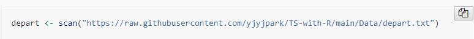

```{r include=FALSE}
knitr::opts_chunk$set(message = FALSE, fig.width=6, fig.height=4, options(width=60))
```

```{r, echo=FALSE}
library(tidyverse)
library(fpp2)
```

# 머리말 {.unnumbered}

시간의 흐름에 따라 관측되는 시계열자료는 경영$\cdot$경제 분야 뿐 아니라 이제는 다른 많은 분야에서도 흔히 접할 수 있는 형태의 자료이다. 시계열자료의 가장 큰 특징은 자료들 사이에 강한 상관관계가 존재할 수 있다는 것인데, 이런 특징으로 인하여 선형회귀모형과 같이 자료의 독립성을 가정으로 하고 있는 모형으로는 시계열자료의 분석에 한계가 있다.

이 책에서는 시계열자료의 예측 모형으로 가장 많이 사용되는 ETS 모형과 ARIMA 모형, 그리고 ARMA 오차 회귀모형을 다루고 있으며,  특히 시계열분석에서 가장 많이 사용되는 R 패키지 중 하나인 패키지 [`forecast`](https://pkg.robjhyndman.com/forecast/)의 다양한 함수의 활용 방법을 소개하고 있다.

이 책은 교우사에서 출판한 "R로 알아가는 시계열분석"에서 사용된 실습 예제만을 추려서 독자들의 R 실습에 작은 도움이 되고자, 패키지 [`bookdown`](https://bookdown.org/)을 사용하여 Rstudio에서 작성되었다. 
또한 이 책애서는 R의 기초적인 사용법 및 패키지 [`tidyverse`](https://www.tidyverse.org/)에 대한 소개 없이 사용하고 있으며, R code에는 프롬프트(`>` 또는 `+`)를 제거하였고, console 창에 출력되는 실행 결과물은 `##`으로 시작되도록 하였다.

제공된 R code를 쉽게 복사하는 방법은 아래 그림과 같이 R code 블록에 마우스를 놓으면 우측 상단에 기호가 나타나는데, 그 기호를 클릭하는 것이다. 



이 책을 작성할 때의 R 세션 정보는 다음과 같다.

```{r}
sessionInfo()
```
